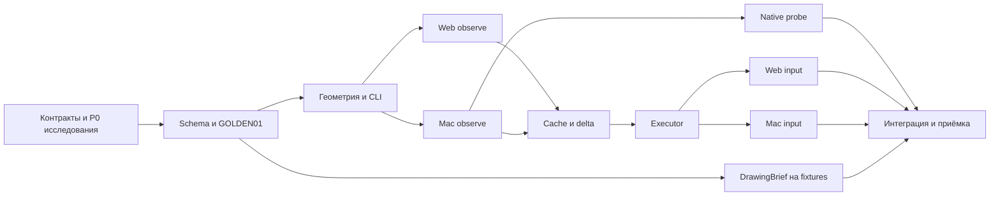

# План разработки UI Blueprint

- ID: `PLAN.UIB@1`; дата: 2026-10-06; статус: предложен для обсуждения.
- Текущая работа: планирование и подтверждение статуса ТЗ; разработка не запущена.
- Основание: [реестр](../specs/README.md) → [ТЗ](../ui-blueprint-spec.md) `UIB.TZ@1.4` → [руководство](../engineering-blueprint-guide.md) `UIB.DRAWING@1.1`.
- Требования: P0–P7, D01–D07, M01–M06, B01–B06, GOLDEN01 и экспорт P6.
- Организация задач и число исполнителей ниже — предложение этого плана, не требование ТЗ.

## Рекомендуемый результат первой цели

Один работающий локальный CLI на собственном Rust engine: точная цель → scoped
наблюдение → измерение/проверка → разрешённое действие с проверенным исходом →
diff/delta → полный DrawingBrief и ImageGen-промпт. На Mac и Web имеются реальные
положительные пилоты, включая native probe M05. Всё это работает без модели.

Одна цель охватывает P0–P7; вехи показывают полезный результат, но не требуют
команды «продолжай» после каждого пакета. Завершение — по [приёмке](ui-blueprint/acceptance.md).
Мобильные плагины, Jev, F1–F4, сервер, MCP, dashboard, атлас, CAD-export и
публикация/деплой не входят в первую цель. Внутренняя сессия CLI входит.

## Как разделить работу

Основная единица — конечный результат с зависимостями и приёмкой, а не отдельный
чат на каждую функцию или обязательный crate на каждую задачу. Один monorepo.
Разработку вести в выбранной текущей ветке `master`; worktrees и новые ветки
не разрешены. Владение файлами и Git-операции регулирует [execution](ui-blueprint/execution.md).

Предлагаются три одновременно полезных рабочих направления: Web, Native и
общее ядро/геометрия. Этот чат ведёт цель, общий контракт, интеграцию и компактные
собственные задачи кода. Проверяющий получает отдельный свежий контекст по риску.
Число чатов не является нормой загрузки: готова одна задача — работает один исполнитель.
Подготовка пакета: [шаблон](ui-blueprint/packets.md); очередь: [реестр](ui-blueprint/task-registry.md).

## Вехи и зависимости

| Веха | Работы | Результат, который можно проверить |
| --- | --- | --- |
| A / P0 | Контрактная маршрутизация, три ограниченных исследования, собственные fixtures, D01–D07 | Обоснованные границы schema/API, support matrix, baseline и пороги; без притворной готовности плагинов |
| B / P1 | Общие типы, validator, GOLDEN01, геометрия, минимальный CLI | Детерминированные данные → измерение/unknown/error; Rust-код уже исполним |
| C / P2 | Параллельные Mac/Web read-only slices | Настоящий scoped observe/inspect/measure из обоих runtime |
| D / P3–P5 | Native probe, projections, cache/delta и затем ввод | Детализация M05, корректные изменения, реальные формы и безопасная остановка |
| E / P6 | Экспорт начинается после B; packaging после интеграции D | Полные observed/proposed пакеты, compare, установка и понятное восстановление |
| F / P7 | Одна интегрированная сборка и сравнительная проверка | Обе платформы, все обязательные gates, измеренные ограничения и воспроизводимая поставка |

Это зависимости приёмки, а не запрет ранней реализации на контролируемых данных.
Cache можно начинать на GOLDEN01; принимать его — после обоих живых источников.
CLI нужен уже для первых slices. Экспорт не ждёт ввода, если контракт данных готов.
Schema получает кандидатную версию в B; совместимость фиксируется после обоих
P2/P5 и P3. Решения о тяжёлых runtime/ABI остаются в D01–D07, не выбираются здесь.

## Основание и контроль объёма

Прочитаны полностью два локальных документа и применимые глобальные правила;
путь чтения: AGENTS → specs/README → ТЗ → руководство; дополнительно RUST,
development/rust, governance реализации, product-truth, QA и координации.
Это Evolve только для статуса документа (`UIB-AUTH-001`); остальное — планирование.
Реализация и upstream-код сейчас не исследовались и не запускались.
Ссылки ТЗ на другие продукты — контекст сценариев, а не разрешение работать в них.
Мобильные/TV/ML-каталоги не входят в closure первой реализации; нужное чтение
upstream назначено конечным задачам перед проектированием соответствующего механизма.

## Следующее решение пользователя

Обсудить и одобрить этот план, границу P0–P7 и [режим координации](ui-blueprint/execution.md).
Затем явно запустить цель и разрешить создание рабочих чатов и сообщения в них.
Текст запуска приведён в execution; он пока не выполнен. План сам себя не утверждает.
Перед запуском сохранить исходную одобренную ревизию и фактическое сообщение
пользователя в реестре, затем выполнять готовые задачи до полной приёмки.
