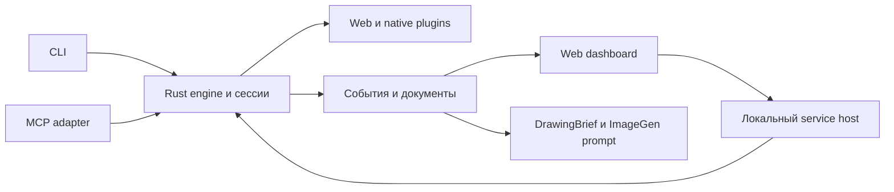

# F1/F2: сессия, host и MCP

- Node type: leaf; domain: `uib.future-host`.
- Contract: `UIB.FUTURE-HOST@1`; stable clause: `UIB.FUTURE-HOST.CONTENT`.
- Authority: Active / Stability: Evolving; future, вне P0–P7; accepted/released baseline: none.
- Authority source: UIB.TZ@1.4 / UIB.DRAWING@1.1, user confirmation 2026-10-06; C00 faithful routing only.
- Read when: только отдельно одобренные F1/F2.
- Do not read when: задача не затрагивает этот домен; reference/future узлы не являются общим preload.
- Requires: [UIB.ACTIONS@1](../product/actions.md), [UIB.CACHE@1](../product/cache.md), [UIB.PRIVACY@1](../product/privacy.md).
- Source mapping: TZ 687–736; [inverse map](../reference/source-map.md); source links are provenance, not requires.
- Precedence: [registry](../README.md); исходные Active нормы при расхождении сохраняют силу; здесь нет новых решений.

## Режимы запуска и дальнейшее развитие

CLI остаётся первым самостоятельным продуктом. Будущие локальный сервер, MCP и dashboard добавляют способы доступа и наблюдения, сохраняя тот же Rust engine, schema и platform plugins. Они не становятся зависимостями P0–P7 и не откладывают готовность основного инструмента.

| Этап | Что появляется | Что остаётся общим |
| --- | --- | --- |
| Сейчас P0–P7 | CLI, адресованные наблюдения/действия, сессия с ограниченным состоянием, полный DrawingBrief и ImageGen-пакет | Rust engine, source identities, semantics/geometry, policies, cache/delta |
| F1 Локальный service host | Явный длительный процесс, несколько клиентов, статус сессий, события и подключение CLI | Те же операции и права; транспорт не создаёт второе ядро |
| F2 MCP adapter | Доступ агента через поддержанный MCP transport | EngineSession и протокол результата |
| F3 Web dashboard | Человек видит работу подключённых агентов, инспектор UI и документы | Один источник фактов, событий и ревизий |
| F4 Atlas и публикация документации | Явная история интерфейса и маршрутов, сравнение ревизий, библиотека принятых blueprint | Наблюдения UI Blueprint; отдельные retention и approval |

F2 и F3 могут развиваться независимо после F1. Android/iOS плагины имеют свои ранее описанные этапы; service/dashboard не являются условием их проектирования. F-этапы — будущая разработка, а не разрешение сейчас создавать сервер, UI или базу данных.

### Общая сессия вместо цепочки CLI

Один service process владеет именованными EngineSession: Target/Surface bindings, графом, revisions, ограниченным cache, request queue и событиями. CLI, MCP и dashboard подключаются как клиенты. Transport session и EngineSession имеют разные идентификаторы и срок жизни. Переподключение UI не должно молча создавать новый граф либо повторно отправлять mutation.

Standalone CLI может использовать engine непосредственно; session-aware CLI — обращаться к локальному host. Одинаковая операция имеет одинаковый контракт в обоих режимах. MCP/dashboard не запускают новый CLI subprocess на каждое измерение и не дублируют геометрические правила.

У операции есть actor_id, session_id, request_id, task/run reference при наличии и scope. Смена клиента не расширяет права. Сериализация физического ввода и ограничения mutation на Target сохраняются. Disconnect не равен cancel уже отправленного действия; cancel/stop следуют основному протоколу.

### Локальный сервер

Service host запускается явно и по умолчанию привязан к loopback или локальному IPC. Он обслуживает версионированные запросы, lifecycle, bounded event stream и разрешённые артефакты. Внешний сервер и аккаунт не нужны для обычной локальной работы.

Нужны аутентификация локального клиента, проверка Origin для HTTP, ограничение artifact roots и отделение read-only инспектора от mutation. Произвольная страница браузера не получает desktop actions через открытый localhost endpoint. LAN/remote доступ — отдельная явная конфигурация и последующий scope.

Для событий возможны SSE либо WebSocket; окончательный интерфейс определяется в F1. Event имеет sequence/cursor, session, request, время/clock domain и тип. Пропуск вызывает resync; медленный viewer не блокирует capture/input. Очередь ограничена, dropped/omitted события обозначены. Повторная доставка события не гарантирует exactly-once исполнение UI.

Graceful stop прекращает новые запросы, завершает или помечает pending work, отключает подписки и очищает свои ресурсы. Пользовательские приложения остаются нетронутыми. Автозапуск после входа в ОС не включается скрыто.

### MCP без второй реализации

MCP adapter публикует те же observe/inspect/measure/check/action и documentation операции. Для локального подключения возможен stdio; для отдельного host — совместимый Streamable HTTP. Версию протокола фиксировать перед F2. [MCP transport contract](https://modelcontextprotocol.io/specification/2025-11-25/basic/transports).

MCP сам по себе не гарантирует долговременное состояние приложения: граф и кэш принадлежат EngineSession. Сервер может жить дольше одной CLI-команды, но retention задаётся явно. Большой scene data доступен через ограниченные ответы и адресуемые ресурсы; не нужно возвращать весь снимок при каждом обращении. Resource link не предоставляет доступ к закрытому файлу.
