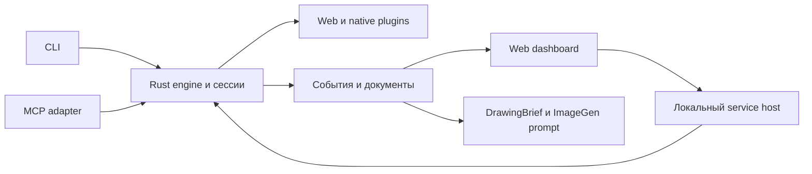

# UI Blueprint общее техническое задание

Источник: [Page](https://chatgpt.com/space/page_5e1c4e973b0c819181b4a4513072b750). Копия от 6 октября 2026 года.

Техническое задание 1.4 от 6 октября 2026 года. Контракт `UIB.TZ@1.4`, Authority: Active, Stability: Evolving. Пользователь подтвердил документ как полноценное ТЗ и снял статус Draft в чате подготовки разработки 6 октября 2026 года. Документ объединяет веб- и Mac-перспективы и является нормативной основой планирования и реализации. Явно открытые инженерные решения D01–D07, предварительные имена и будущие этапы сохраняют обозначенные границы. Подтверждение ТЗ не запускает разработку, инструментирование или QA приложения: запуск следует согласованному плану. Редакция дополнена заданием для будущего агента-разработчика и каталогом обязательного чтения исходников. Добавлены Ui.Vision и UI Atlas, а также отдельное будущее направление атласа приложения. Расширен основной режим инженерного blueprint и связанное руководство; service host, MCP и dashboard описаны как будущие этапы.

UI Blueprint — локальный инструмент для наблюдения, измерения и управления реально работающим интерфейсом. Он превращает доступные runtime-данные в компактную семантическую и геометрическую модель, выполняет расчёты обычным кодом и отдаёт агенту выбранный участок или изменения. Человеку он готовит объяснение и промпт для ImageGen.

Собственные Rust-ядро, аналитика, кэш, diff и CLI работают без обязательной модели. Web, macOS, Android и iOS/iPadOS подключаются отдельными плагинами. Готовые blueprint-продукты служат источниками подходов и переносимой функциональности; они не становятся обязательной цепочкой внешних CLI. Playwright, браузерные протоколы и системные SDK допустимы как средства доступа.

Исходные документы сохраняются отдельно: [веб-видение 0.2](https://chatgpt.com/space/page_06b1be9161288191a37c8cd1512446b7) и [Mac-видение 0.1](https://chatgpt.com/space/page_f33493d6801881919fdb50a2de4c1888). При расхождениях новый документ отражает последние решения пользователя и согласование соавторов, не переписывая историю. Это ТЗ отдельного инструмента; его создание не изменяет приложения, не создаёт репозиторий и не подтверждает runtime-приёмку.

## Назначение и обязательные решения

Два основных сценария:

- Разработка и QA: выбрать компонент → снять состояние → изменить приложение обычным способом → получить геометрический и семантический diff → проверить заданные требования.

- Computer Use: описать форму → найти поля и доступные действия → выполнить разрешённую последовательность → подтвердить результат, обновляя наблюдение на значимых переходах.

Обязательные требования пользователя: данные из настоящего runtime; локальная работа без модели; быстрый ответ для выбранного фрагмента; общие сущности и отдельные платформенные плагины; минимальные обязательные зависимости; собственная реализация аналитики на Rust; кэширование и инкрементальный пересчёт; опциональный Jev; локальная команда подготовки ImageGen-промпта.

Измеренный факт, требование и вывод различаются. Расстояние 12 px не доказывает наличие padding=12 в коде. Доступная кнопка не доказывает разрешённость внешнего действия. Успешный ввод не доказывает принятие данных приложением. Локальные вычисления не расходуют модельные токены, но переданный агенту результат занимает контекст.

В первую версию не входят собственный браузерный движок, универсальный сканер всех чужих приложений, восстановление полного исходного кода по картинке, обучение модели, обязательный графический редактор и автономное изменение дизайна. TV — расширение после проверки основных платформ.

## Архитектура и организация проекта

Общее ядро не импортирует браузерные, Apple, Android или модельные SDK. Плагин отвечает за свою среду; profile связывает данные с продуктовой спецификацией; extension выполняет необязательный анализ. Эти три роли не смешиваются.

```text
crates/
  schema/             версионируемые типы и сериализация
  engine/             граф, геометрия, сопоставление, diff, кэш, проверки
  plugin-api/         lifecycle, capabilities, запросы и результаты
  cli/                единый интерфейс пользователя и агента
plugins/
  web/                DOM, AX, layout, браузерные действия
  macos/              окна, AX, разрешённый нативный ввод
  android/            Android-наблюдения и ввод
  ios/                iOS/iPadOS developer-интеграция и ввод
extensions/
  jev/                необязательная внешняя классификация
profiles/
  playphraseme/       продуктовые ожидания и сценарии
```

Имена пакетов предварительные. Общая логика переносится в engine при подтверждённой повторяемости; платформенная специфика остаётся в своём плагине. Узкий JS/TS-код внутри браузера, Swift-мост или Kotlin-мост допустимы как сбор/ввод. Второе аналитическое ядро на этих языках не создаётся.

Web-задача не загружает Apple/Android-зависимости и не сканирует другие приложения. Ненужные расширения не запускаются. Возможна поставка одного бинарного файла с выбранными модулями; обязательного запуска отдельного процесса на каждое измерение нет. Точный механизм подключения — сборочные features, стабильный транспорт или изолированный процесс — выбирается в проекте реализации. Логические границы и проверка версий обязательны при любом варианте.

Локальная сессия может сохранять соединение с runtime и граф между короткими CLI-запросами. Это не означает постоянный сбор всего экрана. Срок жизни и очистка принадлежат сессии; завершение затрагивает только её ресурсы.

Поток данных: платформенный плагин → нормализованные наблюдения → Rust-граф и расчёты → compact/JSON/diff → агент или ImageGen-промпт. Действия проходят обратным маршрутом через проверку цели и разрешений, а не через аналитику, напрямую изменяющую приложение.

## Контракт плагинов и границы платформ

Плагин сообщает plugin_id, version, диапазон schema_version, типы Target и capabilities. Для свойства или операции capability имеет supported, partial, unsupported либо permission_required с причиной. Наличие плагина не гарантирует право доступа к конкретному окну.

Общий жизненный цикл: attach → observe / subscribe / act → detach. subscribe необязателен; поддержка наблюдения не подразумевает поддержку действий. Запрос содержит Target, scope, fields, режим, пределы ответа и deadline. Отмена не оставляет фоновые обходы и не продолжает очередь ввода.

| Плагин | Источники | Граница достоверности |
| --- | --- | --- |
| Web | Живая вкладка, DOM, accessibility, layout; CDP там, где доступен | Повторный рендер HTML в другом движке не является измерением исходной вкладки |
| macOS | AX, оконные сведения и разрешённый захват | AX-дерево может опускать внутренние контейнеры и декорации; AX bounds не становятся layout bounds |
| Android | Разрешённые accessibility/UI-инструменты, debug SDK | Объединённая семантика и внутренняя раскладка имеют разное покрытие |
| iOS/iPadOS | Разрешённая developer-среда, инструменты ввода или SDK приложения | Нет обещания свободного внешнего доступа к любому приложению физического устройства |
| TV позднее | Платформенный фокус и remote-ввод | Отдельные семантика, возможности и проверки, без имитации мыши |

Внешний режим использует существующие данные среды без изменения исследуемого приложения. Встроенный debug-режим сообщает измеренную после layout геометрию, явные component IDs и необязательную связь с исходниками. SDK остаётся тонким сборщиком и использует общий контракт. Его данные имеют отдельный источник и не выдаются за внешнее наблюдение release-приложения.

Read-only наблюдение не меняет фокус, значения, scroll, размер окна или раскладку ради улучшения извлечения. Требующее такого воздействия действие выполняется отдельно и только в разрешённом сценарии. Диагностический overlay исключается из собственного дерева и hit testing. Preview, instrumented build, release runtime, Simulator и physical device имеют разные environment-метки.

Системные права, backend-ограничения и правила проекта сохраняются. Новый плагин не служит обходом отказа другого инструмента. Отсутствие возможностей возвращается явно; скрытой установки или переключения платформы нет.

## Нативное наблюдение и изображения

Этот раздел разработан Mac-соавтором и согласуется с общим контрактом данных. Нативный плагин должен выдерживать неполную семантику, несколько поверхностей и потенциально медленные системные запросы.

Три независимых канала:

- external_semantics: доступные AX-атрибуты и действия;

- rendered_capture: изображение выбранного окна или композиции дисплея;

- opt_in_layout_probe: измерения после layout из собственного debug-приложения.

У каждого канала свои capabilities и разрешения. Отсутствие доступа к пикселям не отменяет доступный AX-ответ, а недоступный AX не запрещает разрешённый crop. Режим помечается degraded/partial, без объявления всей платформы unsupported. Read-only запрос не открывает системный диалог разрешений автоматически: при нехватке прав возвращается permission_required. Запрос разрешения — отдельный явный шаг допустимого сценария.

Capability уточняется на уровнях Target, Surface, Element и property. Возможность записи проверяется для конкретного атрибута перед setter; допустимость нового значения проверяется отдельно; действия берутся из доступного списка, а не выводятся только из role. Сбор использует перечень нужных атрибутов, пакетные чтения там, где доступны, ограниченный обход children и deadline. Ошибка одного атрибута не обнуляет другие. Один зависший Target не должен блокировать независимые сессии.

Оконная идентичность и принадлежность AX-данных проверяются отдельно. Если точное окно не сопоставлено, application_partial допустим только как явно более широкий диагностический результат с requested_surface_unresolved; он не выдаётся за снимок запрошенного окна и не содержит пригодных к мутации refs. Application scope должен быть уже разрешён задачей. Если разрешено только одно окно, ошибка matching возвращает target_unresolved и минимальные кандидаты без содержимого других окон. Нельзя расширять window-only scope ради удобного чтения. Ответ отдельно хранит requested_target, resolved_scope и unresolved_surfaces.

Popup, меню и системный ввод могут принадлежать отдельным Surface или процессам. native_owner/process identity хранится отдельно от initiated_by/anchored_to. Их owner/relationship должны иметь источник. Геометрическое пересечение не устанавливает владение. Включение системной поверхности требует явной адресации и допустимости по policy. external_surface_detected — диагностическое событие, не безусловный отказ: известная разрешённая поверхность может включаться штатно. Невозможность установить её цель или связь возвращает target_unresolved и останавливает зависимое действие, сохраняя исходную сессию; нехватка прав отражается отдельно. Встроенный SDK не экспортирует выдуманную структуру системного диалога.

Изображение содержит capture_kind: window_isolated или display_composited, фактический capture_target, pixel_buffer_size, crop_transform, время capture и доступные content-rect/scale сведения. Изолированный захват окна не доказывает видимость его содержимого на перекрытом рабочем столе. Frame также содержит included_surface_ids, excluded_surface_ids и unresolved_surface_ids: отсутствие попапа в кадре не означает отсутствие попапа в UI. Parent-window capture не считается автоматически содержащим дочерние popup-окна. При resize нельзя выводить scale только из размера pixel buffer: используется доступный frame-to-window transform и frame metadata. Для утверждений об окклюзии нужен соответствующий источник. Аудиозахват выключен по умолчанию и не включается вместе с UI capture. Capture_filter и применённые исключения сохраняются явно: display_composited с отфильтрованными окнами не считается неизменённым видом рабочего стола. Списки Surface перечисляют известное покрытие; их полнота имеет отдельный статус. Пустой список при неполном знании не доказывает отсутствия других окон или перекрытий.

Основание различия: Apple описывает desktop-independent single-window capture, которое может включать перекрытое/внеэкранное содержимое, исключать child/pop-up windows и масштабировать контент в заданный output buffer. [ScreenCaptureKit, WWDC22](https://developer.apple.com/videos/play/wwdc2022/10155/).

Связь AX bounds с capture frame проверяется по Target/Surface generation, времени и преобразованиям. При неизвестном mapping не выдаются точный overlay и координатный click. Несколько мониторов, разные scale contexts и перенос окна не сводятся к одному DPR. Отсутствие image mapping не запрещает отдельно разрешённое семантическое AX-действие по однозначно установленной актуальной native-цели; такой результат не используется как проверка попадания указателя.

Opt-in probe сообщает измеренный output, а не значение modifier из исходника. Связь с файлом и измеренные bounds — разные поля. Probe не меняет accessibility, focus, hit area, layout или продуктовые данные. Приёмка проверяет это сравнением instrumented/uninstrumented fixture; private API не становятся неоговорённым основанием. SDK-кадр не заменяет внешнее наблюдение канонической сборки.

Для обычной проверки нужен именно размер/состояние проверяемого сценария. Нет общего требования максимального окна, физического монитора или 2x. Поддержанный виртуальный дисплей пригоден там, где сценарий не требует конкретного физического свойства. Изменять конфигурацию дисплеев только ради удобного захвата не требуется.

## Общая модель и происхождение данных

Внешний формат использует snake_case. Нативные имена сохраняются в namespaced extensions; новая схема не переименовывает существующие программные идентификаторы приложения.

| Сущность | Смысл |
| --- | --- |
| Target | Точное приложение/процесс, вкладка или устройство и его поколение |
| Surface | Окно, документ, frame, popup, sheet или встроенная поверхность |
| Observation | Интервал сбора, источники, среда, согласованность и покрытие |
| Snapshot | Материализованный граф наблюдённых данных с revision |
| Element | Узел конкретного источника с семантикой, состоянием и геометрией |
| Component при наличии | Логическая группа, подтверждённая явным mapping приложения |
| Region | Выбранная область или помеченная вычисленная группа |
| Relation | Семантическая, визуальная, компонентная, фокусная либо геометрическая связь |
| Action | Намерение, цель, способ ввода, предусловия и разрешённый scope |
| Transition | Действия и наблюдаемые результаты с привязкой к снимкам |
| Expectation | Требование со своим источником, условиями и допуском |
| Finding | Результат проверки или вывод с доказательствами и ограничениями |

Observation описывает получение данных, Snapshot — сохранённое состояние графа. Точность API не предполагается абсолютной. Для каждого свойства отдельно описываются:

- provenance: reported — сообщил API; derived — вычислено; estimated — эвристика или модель;

- availability: known, unknown, unsupported, redacted; not_requested описывает отдельную ось выбора полей (projection/fields), а не доступность запрошенного свойства;

- источник, время и Observation;

- точность/погрешность, когда она имеет измеримый смысл.

Декларативные сведения из кода/SDK хранятся отдельно в source_declarations: например заданный modifier, component ID или явный mapping. Это metadata с источником, а не измеренная геометрия и не автоматическое требование к продукту. Declared Expectation дополнительно содержит источник нормативного решения. Confidence не придумывается для каждого узла: она допустима при определённом методе оценки.

Источник ответа live/cache, свежесть current/stale/unverified с временем последней проверки, согласованность stable/unstable/unknown и покрытие complete/partial/unknown — независимые оси. Полнота относится к явно заданным scope и fields, а не ко всему приложению. Кэшированный ответ может быть актуальным и частичным. Даже новый live-сбор не гарантирует пригодность цели к более позднему действию.

Словарь ролей сохраняет необходимые различия: text, heading, textbox, searchbox, button, link, checkbox, radio, switch, combobox, option, list, listitem, menu, menuitem, tab, dialog, form, group, scrollarea, slider, image, media, custom, unknown. Исходная native_role обязательна при её наличии. Точные mapping-правила версионируются.

Семантический родитель, визуальный контейнер, владелец компонента, якорь попапа и поверхность не сводятся к одному дереву. Общий граф хранится локально; формат ответа не обязан включать его целиком.

## Геометрия и координаты

| Поле | Значение |
| --- | --- |
| layout_bounds | Рамка системы раскладки |
| accessibility_bounds | Рамка, сообщённая accessibility API |
| hit_region | Подтверждённая или частично проверенная область взаимодействия |
| visible_region | Видимая область с учётом известной обрезки и перекрытия |
| paint_bounds при наличии | Отдельные сведения о границе рисования; не замена visible_region |

Неизвестные поля не заполняются другой рамкой без маркировки происхождения. Layout-рамка текста не равна контуру букв. Пересечение bounding boxes не доказывает визуальное перекрытие; z-index без контекста наложения недостаточен. Тени, прозрачность, blur, Canvas и системные эффекты могут остаться неизвестными.

Каждая геометрия указывает coordinate_space, units, origin и transform. Возможны screen, window, surface, viewport, document и local spaces; исходные px, css_px, pt и dp сохраняются. Поддерживаются rect, а при необходимости quad/polygon/fragments. Преобразования между окнами, frame, scroll-контейнерами и изображением имеют явный источник. Если нужный transform неизвестен, измерение возвращает missing_transform.

Window-local сравнение отделяет перенос окна от изменения внутреннего layout. Размер текста, display scale, zoom, ориентация, safe area, keyboard/visual viewport и scroll входят в контекст применимых измерений. Физические left/right и логические leading/trailing различаются; направление текста не означает направление всей композиции.

Базовые расчёты: размер, пропорция, расстояние между краями/центрами, доступная baseline, выравнивание, вложение, пересечение, overflow, равенство промежутков с допуском. Измеренный inset не называется padding без отдельного источника.

Viewport и visual viewport относятся к web extension. Для нативного UI используются display/window/content/safe-content пространства; конфигурация дисплеев имеет собственную ревизию. Смена этой конфигурации инвалидирует зависимые преобразования.

Стабилизация ограничена выбранной областью. Видео не должно задерживать измерение неподвижной формы до полной остановки всех пикселей. Время начала/окончания сбора и рассогласование дерева с crop сохраняются. Транзиентное состояние не принимается за финальную геометрию.

## Выбор области и проекции

Scope задаётся по семантическому запросу, наблюдённому ref, устойчивому locator, точке или прямоугольнику. Ограничения fields, depth и max_elements задают стоимость ответа. По умолчанию не обходится всё приложение.

Контекст включает необходимые label/error, контейнер, соседей, scroll-owner, anchor и возможную блокирующую Surface. Попап может находиться в другом поддереве или окне. Выход за исходный scope допускается только как явно обозначенное включение зависимого контекста внутри разрешённого Target; чужие окна не добавляются молча.

Сначала используются явные связи. Пространственная кластеризация по близости — дополнительный derived/estimated результат, не доказательство структуры компонентов.

Две проекции:

- interaction: единый контрол с именем, состоянием и действиями;

- design: внутренние части, подписи, иконки и геометрические отношения.

Обе используют общий граф, но не требуют соответствия узлов один-к-одному. Идентичности разделены по источникам: AX-кнопка может представлять контейнер, иконку и текст debug-probe. Связи represents/corresponds_to допускают many-to-many и содержат происхождение. logical_component_key создаётся только при явном mapping, а не по совпадению рамок. Эвристические связи не склеивают source IDs и не разрешают действие. Actionable ref остаётся у узла соответствующего backend; декоративный design child не становится кнопкой.

Упрощение представления не удаляет исходные данные из графа. Подавленный проекцией узел не считается исчезнувшим. Внешний сбор может не раскрыть внутренние части: design возвращает partial/not_exposed, а точную причину combine/ignore сообщает только при отдельном подтверждении. Полная design-проекция любого чужого приложения не обещается.

Лимит ответа возвращает coverage, omitted_count или unknown_count и cursor. Cursor привязан к ревизии; после её несовместимого изменения требуется новый запрос. Невидимые, нераскрытые и виртуализированные элементы не перечисляются как полностью исследованные. Смена scope или фильтра полей сама по себе не означает удаление узлов.

## Семантика форм и ввода

Собираются доступные name/accessibility_name, visible_text, description, value, placeholder, input_kind, required, enabled, readonly, checked, selected, expanded, focused, invalid и действия. Видимость, включённость в accessibility, возможность фокуса и активации независимы.

Отдельно хранятся keyboard_focus, accessibility_focus, active_descendant и, при поддержке, text_selection/caret и composition_state. Система не угадывает IME или положение каретки по конечной строке. Единицы offsets указываются явно.

Связи labelled_by, described_by, error_for, controls, owns, member_of, anchored_to и return_target сохраняют смысл. Tab-порядок, чтение и направленный фокус различаются. Неизвестный маршрут фокуса не заменяется порядком геометрических координат.

Намерения focus, activate, fill, type, select_option, set_checked, scroll, press, submit и dismiss имеют конкретный backend и способ ввода. set_checked(true) отличается от toggle. Семантическая активация, pointer, touch, keyboard и remote не взаимозаменяемы при проверке самого жеста. Прямой setter и ввод через IME имеют разные события.

Для автокомплита различаются введённый draft, активная подсказка и подтверждённый выбор. Для формы различаются DOM/native value, прикладное applied value и завершённый бизнес-результат. Их связь определяется profile/Expectation; имя поля не раскрывает её автоматически.

Dismiss может сохранить изменения, отменить их или быть недоступным. Enter может выбрать подсказку или отправить форму, поэтому не добавляется исполнителем по умолчанию. Проверка invalid=false не доказывает успешную серверную операцию.

Защищённые значения редактируются через ограниченный механизм ввода, но не возвращаются в диагностический граф. Отсутствие значения из-за редактирования обозначается redacted, а не пустой строкой.

## Идентичность и актуальность цели

Target включает процессную сессию, точное окно/вкладку/устройство и target_generation. Surface имеет свой surface_id и generation, например для отдельного popup или нового документа. Один PID, window ID, URL или заголовок недостаточен: они могут повторно использоваться.

Element имеет source namespace и session element_key для хранения; ref привязан к конкретным источнику, наблюдению и поколению. Locator служит повторному поиску. Координаты не являются устойчивым ID. Remount, перезапуск процесса, закрытие попапа и переиспользование виртуализированной строки инвалидируют соответствующие refs.

Перед действием проверяются Target, Surface, ref, единственность совпадения и необходимые свойства. При сомнении возвращаются stale_target или ambiguous_target. Устаревшая координата не применяется к соседней кнопке. Для повторного исполнения после повторного поиска создаётся актуальная привязка.

Сопоставление для diff допускает reported key или эвристические кандидаты с явной отметкой. Вероятное совпадение помогает анализу, но никогда само по себе не даёт права активировать элемент, в том числе если его предложил Jev.

На нескольких дисплеях сохраняются применимые пространства и преобразования; одного глобального scale недостаточно. При перемещении Surface обновляются её координаты, а внутренние изменения сравниваются в выбранном локальном пространстве.

## Исполнитель действий и протокол результата

Последовательность observe → prepare → resolve → act → verify → delta связывает каждый шаг с текущим наблюдением. Prepare описывает план и предусловия; он не создаёт новую авторизацию. Обычные уже разрешённые действия не требуют дополнительного пользовательского подтверждения только из-за наличия prepare.

Независимые заполнения допускаются в одном вызове, но выполняются упорядоченно. Исполнитель перепроверяет предусловия и результаты. Попап, асинхронная валидация, новая форма, навигация, изменение доступности или разрешений прерывают предсказуемый участок для свежего наблюдения.

Политика по умолчанию stop_on_error. Зависимые действия прекращаются после failed, interrupted или unknown_outcome. Продолжение независимых шагов допустимо только при явно выбранной политике сценария. Batch не является транзакцией и не обещает отката выполненных действий.

В Transition фиксируются запрошенное намерение, фактические backend/input_modality, цель, шаги, наблюдения до/после и результат. AX activate может подтвердить активацию, но не попадание указателя; setter не доказывает работу экранной клавиатуры; callback не доказывает доставку реального жеста.

Результат содержит completed_steps, outcome каждого запущенного шага, stopped_at и непройденное условие. Неизвестный исход отправки формы не повторяется автоматически. Для продолжения сначала устанавливается фактическое состояние приложения.

Единый ответ: schema_version, request_id, target, observation/snapshot, capabilities, coverage, data, issues. Ошибки имеют машинный code, scope и достаточную причину. Основные коды: unsupported, plugin_not_installed, incompatible_version, permission_required, target_unresolved, stale_target, ambiguous_target, unstable_state, incomplete_scope, missing_transform, resync_required, timeout, interrupted, action_outcome_unknown. external_surface_detected — диагностическое событие; оно становится причиной остановки только при неразрешённой или неустановленной цели/связи, а не при любом появлении известной поверхности.

Timeout ограничен конкретным условием и deadline. Ожидание относится к выбранному результату, а не к полной сетевой тишине. После отмены не продолжаются скрытые клики. Смена backend не обходит tool-policy или требуемую передачу действия пользователю.

Физические клавиатура, указатель и фокус имеют одного владельца на время воздействия. Параллельные адресуемые вкладки/устройства допустимы только при поддержанной изоляции и отсутствии конфликтующего состояния.

## Кэш и инкрементальные обновления

Локальное состояние переиспользуется между запросами. Снимки, пространственные отношения и результаты проверок кэшируются отдельно. Ключи учитывают Target/Surface generations, schema/plugin version, scope, projection, fields и параметры среды. Pixel-кэш не выдаётся как свежая картинка по факту обновления семантики.

Нативные/браузерные события — сигналы инвалидирования, а не гарантированно полный журнал. Изменения родителя, шрифта, текста, safe area, zoom, viewport или scroll могут затронуть соседей. Минимальный пересчёт допустим при известной зависимости; иначе обновляется более широкая область. При потере событий выполняется bounded resync.

Кэш имеет лимиты памяти, срок жизни, владельца и cleanup на detach. Его вытеснение не означает исчезновение UI-элемента. TTL сам по себе не подтверждает актуальность; перед действием перепроверяется нужная цель. Неизвестное новое значение не заполняется старым значением под свежим timestamp. Исторический факт можно сохранить только как исторический с его временем.

Delta применяется атомарно к локальному графу. Это не обещание атомарного захвата постоянно меняющегося UI. Обязательная совместимость: Target/Surface generations, scope, schema/plugin version, projection, fields и base_revision. Изменившиеся условия требуют совместимого полного снимка.

Upsert заменяет полное представление source-узла в согласованных projection и fields; удаления задаются явно. Для каждого запрошенного свойства новое состояние известно либо обозначено unknown/unsupported/redacted. Поле вне fields имеет selection=not_requested: оно не удаляет отдельно сохранённый исторический факт, но этот факт не объявляется свежим или входящим в текущую проекцию. Изменения children, relations и focus согласованы в одной ревизии. Удаление подтверждается наблюдением в покрытой области; обрезка ответа, смена scope и виртуализация без известной идентичности не становятся безусловным deleted.

Иллюстрация сокращённого сообщения; идентификаторы условные:

```json
{
  "schema_version": "0.3-draft",
  "plugin": {
    "id": "web",
    "version": "0.1"
  },
  "target": {
    "id": "tab7",
    "generation": "g3"
  },
  "surfaces": [
    {
      "surface_id": "document7",
      "generation": "d5"
    }
  ],
  "scope_id": "filter-panel",
  "projection": "interaction",
  "fields": [
    "role",
    "name",
    "state.enabled",
    "state.focused"
  ],
  "base_revision": 41,
  "revision": 42,
  "coverage": {
    "status": "complete",
    "within": "requested_scope_and_fields"
  },
  "upsert": [
    {
      "element_key": "web.dom:e8",
      "surface_id": "document7",
      "role": "textbox",
      "name": "From",
      "state": {
        "focused": true,
        "enabled": true
      }
    }
  ],
  "removed": [
    "web.dom:e14"
  ],
  "focus": {
    "keyboard": "web.dom:e8"
  }
}
```

Полный протокол дополнительно содержит Observation, provenance и доступность свойств; в сокращённом примере перечисленные значения известны. Получатель с другой base_revision или несовместимым контекстом возвращает resync_required. Эквивалентность full/delta проверяется для одной исходной source-state/revision и одинакового покрытия через replay одного журнала или контролируемый checkpoint. Два последовательных live-захвата меняющегося UI не обязаны совпадать. Изменения текста, состояния, фокуса, структуры и геометрии можно выбирать раздельно.

## Геометрические правила и прикладные ожидания

Rust-ядро реализует отношения gap, aligned, inside, intersects, width/height, ratio, equal_spacing и доступные baseline-проверки. Язык правил представляет эти операции, а не произвольный исполняемый код из страницы.

Условный пример:

```text
gap(icon.layout.right, label.layout.left) = 8 ± 1 css_px
aligned(menu_rows.layout.leading) tolerance 1 pt
inside(popup.layout, viewport) margin >= 12 css_px
```

Expectation содержит id, scope, targets, relation, параметры, units, tolerance, applies_when и expected_from. Последний ссылается на пользовательское решение, продуктовый контракт или проверенную fixture. Условие платформы, размера текста, input-mode и доступности данных входит в правило.

Check возвращает pass/fail/unknown с измерением, допуском, Observation и причиной. Отсутствие измерения не считается pass. Проверка существования элемента отличается от проверки его состояния. Локальный source profile не имеет права превратить старый QA-лог в новый контракт.

Profile PlayPhrase.me декодирует прикладной смысл вроде filters.year из URL и связывает его с черновиком поля. Такой смысл не вшивается в engine. Несогласованные спецификация и QA помечаются как conflict; спорная проверка не переопределяет продукт молча.

Геометрия поддерживает диагностику и приёмку, но не заменяет весь сценарий. Сохранение настройки требует повторного открытия; воспроизведение — наблюдаемого изменения media; успешная внешняя операция — отдельного результата, не одного снимка.

## Сценарии веба

Эта матрица взята из исходного веб-ТЗ и его выбранных контрактов. Она определяет полезные задачи инструмента; существующие VERIFIED-метки QA не являются новым запуском.

| ID | Сценарий | Требуемое наблюдение и проверка |
| --- | --- | --- |
| W01 | Частичный год или IMDb | Draft отдельно от применённого filters; debounce и изменение URL проверяются отдельно |
| W02 | Автокомплит режиссёра | Фокус поля, active_descendant, выбор клавиатурой, закрытие попапа и applied value |
| W03 | Точный фильм | Сохранённые значения общих фильтров при disabled; после очистки восстановление редактирования |
| W04 | Удаление тега | Desktop remove без открытия popover; на mobile вся Cast-плашка — цель удаления |
| W05 | Попап над сеткой | Anchor, геометрия и hit testing вне попапа; отсутствие невидимого блокирующего слоя |
| W06 | Локализация | Отображаемые подписи меняются, канонические значения и язык корпуса не подменяются |
| W07 | Сохранение настройки | Pause Between Repeats после закрытия/открытия; подпись 1 sec отдельно от value 1000 |
| W08 | Большой текст | Доступность контролов, отсутствие overflow, реальный режим text size |
| W09 | Мобильная навигация | Filters открывается из Clip Search в секции с Back, отдельно от desktop rail |
| W10 | Выбор фразы после ввода | Смена draft/query, фокуса, экранной клавиатуры и состояния видео раздельными наблюдениями |
| W11 | RTL-текст | Направление текста отдельно от LTR-компоновки; отсутствие автоматического зеркалирования |
| W12 | До и после правки | Геометрические изменения при сохранённых ролях, значениях и действиях |

W01–W06 и W09 опираются на phrase-search-filters.surface-controls и phrase-search-filters.mobile-source-response, а также три QA-кейса desktop/mobile/locale filters. W07 — settings.overview-behavior и tc-settings-modal-controls-persist. W08/W10 — mobile-layout и связанные QA. W11 — interface-localization.translation-direction. W12 — общий сценарий инструмента, предложенный по этим задачам. Точные ссылки сохранены в приложении источников.

Два известных ограничения источников сохраняются: требование ellipsis для длинных тегов режиссёра расходится с Q1 desktop-кейсом; CSS zoom в старом кейсе мобильных настроек не заменяет native content size Simulator. Они не «исправляются» этим ТЗ и не импортируются как согласованные ожидания.

## Сценарии Mac и мобильных Apple приложений

Mac-соавтор повторно проверил выбранные leaf-контракты и актуальную QA-политику. Ниже спецификационные сценарии, а не отчёт о текущих кадрах.

| ID | Сценарий | Требуемое наблюдение и проверка |
| --- | --- | --- |
| N01 | Точный draft и продолжение ввода | Ввод/вставка/selection/IME; Tab completion; macOS 15+ caret-at-end отдельно от macOS 14 |
| N02 | Нативный filter popover Mac | Немедленный выбор, multi/single-select, локальный Clear, Escape/outside dismiss, допустимый fallback размещения |
| N03 | Фильтр iPad | Autofocus поиска, пояснение не input, Done только закрывает, адаптация popover к sheet, landscape Pro 13/11 |
| N04 | Короткая надпись и полный смысл | Visible label максимум два приоритетных значения и +N; полный accessibility-name; anchor всей кнопки; minimum hit target 44 pt |
| N05 | Resize Mac Search | Нативная перераскладка, перенос/сжатие/truncation/scrolling без требования масштабировать всё пропорционально |
| N06 | iPhone и accessibility text size | Условные правила колонки, действий, targets и scroll; Dynamic Type меняет композицию; формат видео в этой поверхности 4:3 |
| N07 | Происхождение QA-доказательств | Точный build/Target/backend/input; автоматизация, реальное взаимодействие и визуальная проверка отдельно; Simulator не физическое устройство |

N01: query-binding@2, destination-autofocus@1. N02: macOS filter popover@1, source r2. N03: iPad filter popover@2. N04: learner filters@3. N05: point-sizing@1. N06: aligned-column@5. N07: runtime acceptance и native-ui-tools@1. Точные ссылки — в приложении.

Числа и поведение этих сценариев принадлежат конкретным продуктовым контрактам. Они не становятся универсальными правилами UI Blueprint: например, 44 pt не вводится как единый глобальный порог для всех платформ, а 4:3 — как формат любого видео.

Кандидат T01: направленный TV-фокус, remote-команды и возврат на исходный элемент. Перед включением в приёмку потребуется отдельный полный маршрут TV-контрактов.

## Применение к PlayPhrase.me и актуальная QA политика

Web: текущая маршрутизация выбирает Codex in-app Browser, если он поддерживает сценарий. Generic Chromium может показать unsupported-browser surface. Сборщик подключается к разрешённой среде и её возможностям. Серьёзная мобильная веб-приёмка использует обычный iOS Simulator Safari с Web Inspector, native content size large/accessibility-large и реальной экранной клавиатурой для сценариев ввода; desktop mobile viewport — предварительный сигнал.

Native: native-ui-tools@1 от 6 октября 2026 года разрешает точечное AX/view inspection, bounded waits и обоснованную focused UI automation/snapshot-проверку. Старый blanket ban в Mac Draft исторический и не действует как правило нового документа. Канонические Computer Use action-state-visible-result и визуальная приёмка сохраняются.

Для native-результата отдельно отражаются automated_checks, real_app_interaction и visual_verification. Положительный результат первого не закрывает два остальных. Сохраняются build identity, environment, input modality, исходное состояние, действие и видимый результат.

Это локальные политики PlayPhrase.me; они не распространяются автоматически на другие проекты. Создание ТЗ не разрешает добавлять SDK, новые test targets, обходить ограничения инструментов или запускать приложение. Первые пилоты можно выполнять в отдельных контролируемых fixtures; применение к реальному продукту следует его действующему маршруту.

## Консольный интерфейс

Одна команда uiblueprint адресует собственный движок и выбранный плагин. Синтаксис предварительный; команды не реализованы.

| Команда | Результат |
| --- | --- |
| plugins list | Установленные плагины, версии, совместимость |
| capabilities --plugin web --target … | Поддержка конкретных наблюдений/действий |
| observe --target … --scope … --mode semantic | Снимок семантики без обязательного изображения |
| observe --target … --scope … --mode geometry | Доступная геометрия и связи |
| observe --target … --scope … --mode pixels | Изображение при поддержке backend |
| inspect --snapshot … --ref … --view interaction | Компактный контрол для взаимодействия |
| inspect --snapshot … --ref … --view design | Детальная геометрия компонента |
| neighbors --snapshot … --ref … | Нужное окружение с ограничениями области |
| measure --snapshot … --from … --to … | Расстояние или отношение |
| diff --before … --after … | Сопоставление состояний с достоверностью |
| changes --since … | Совместимый поток delta или resync_required |
| check --snapshot … --expectations … | Проверки с происхождением требований |
| form describe --target … --scope … | Поля, отношения, draft/selection/focus |
| action prepare --scenario … | Ограниченный план действий |
| action execute --plan … | Выполнение разрешённого плана с поэтапным результатом |
| imagegen-prompt --snapshot … --purpose document --profile blue-engineering | Полный DrawingBrief, план листов и подробный ImageGen prompt |
| imagegen-prompt --before … --after … --purpose compare | Локальный промпт сравнения |
| analyze --extension jev --scope … | Явный вызов опциональной классификации |

Snapshot ID и Observation ID различаются; CLI может вернуть оба. Read-only команды не подразумевают focus/scroll/activate. MCP при необходимости предоставляет те же операции без второго движка. Полное состояние хранится локально; stdout по умолчанию короткий, JSON доступен явно.

## Инженерная документация и ImageGen

Основной человекочитаемый результат — полный инженерный blueprint выбранного интерфейса для документации, согласования с клиентом и фиксации QA. Команда imagegen-prompt локально собирает развёрнутый DrawingBrief, scene/dimensions, план листов, подробный self-contained prompt и разрешённые references. Она не вызывает модель и не требует ключа. Полный контракт, чертёжные правила и большой шаблон заданы в [руководстве инженерной визуализации и ImageGen](/Users/eugenepotapenko/Projects/potapenko-github/ui-bluprint/docs/engineering-blueprint-guide.md), версия 1.1 (`UIB.DRAWING@1.1`).

Режим document — полный вид текущего интерфейса, основной по умолчанию; explain может сохраниться как alias. propose — будущая схема с явно заданными требованиями; detail — увеличенный узел; flow — карта подтверждённых состояний/переходов. compare до/после остаётся дополнительным режимом. Полнота относится к объявленному scope и состоянию: весь viewport, scroll-document и всё приложение не взаимозаменяемы. Для сложного scope формируется комплект общего и детальных листов вместо нечитаемой одной картинки.

Основной визуальный preset — Blue Engineering: ровный синий/голубой фон, белые контуры и надписи, плоский ортогональный вид, иерархия линий, размеры и выноски, оси, ID компонентов, легенда и штамп с ревизией/статусом. Это инженерное описание UI, без перспективы и декоративной фантастики. Точные размеры, padding/radius/hit regions показываются только по известному источнику. Полный шаблон включает scope, environment, ведомость компонентов, размерные anchors, unknown, состояния и правила проверки; ссылка на приватный документ сама по себе не заменяет включения этих сведений в prompt.

Предлагаемый вызов основного режима после реализации:

```text
uiblueprint imagegen-prompt --snapshot S42 --purpose document --scope main-window --profile blue-engineering --out ./drawing-package
```

Пакет содержит manifest.json, drawing-brief.md, scene.json, dimensions.json, sheets.json, prompt.txt и разрешённые references. Полный пример промпта и синтетическая схема целого интерфейса находятся в связанном руководстве; короткое пояснение агента не считается инженерным заданием.

ImageGen оформляет пакет по отдельному запросу. source_kind (observed/proposed), validation_status и approval_status независимы. После генерации проверяются численные подписи, состав, ID, геометрические связи, coverage и читаемость. Изображение может стать проверенным приложением к документации, но само не создаёт продуктовых требований и не доказывает CAD-масштаб. Для метрически точного вывода остаётся опциональный deterministic SVG/PDF/overlay. В spec-first работе отдельно сохраняются утверждённый проект, runtime-наблюдение и QA-результат; baseline не перезаписывается текущим кадром без принятого решения.

Jev от TypeSafe AI — отдельное расширение, выключенное по умолчанию. Пользователь подключает его со своими учётными данными и условиями оплаты. Без него работают наблюдение, вся формальная аналитика, diff, CLI и обычное исполнение.

Jev получает минимальный разрешённый очищенный фрагмент и возвращает inference с происхождением и доступной оценкой уверенности. Он не меняет observed facts и не разрешает действие по вероятному совпадению. При отсутствии ключа, сети или сервиса основной путь продолжает работать; неоднозначность возвращается агенту. Автоматического платного fallback нет.

Другие классификаторы и visual parsers могут появляться через тот же интерфейс extensions. Их наличие в списке аналогов не означает включения в MVP.

## Собственная реализация и open source

Выбранное направление — перенос полезной аналитической и измерительной функциональности в собственные Rust-пакеты. Готовые Blueprint/Galen/Peekaboo/AXorcist продукты не являются обязательными runtime-зависимостями целевой поставки. Референсные CLI можно использовать при исследовании и сравнении; пользовательский путь не должен требовать сборки цепочки чужих приложений.

Это не требование переписать браузер или ОС. Системные API, протоколы и небольшие необходимые библиотеки допустимы внутри соответствующего плагина. Поставляемые зависимости фиксируются с назначением; зависимости другой платформы и платные расширения не обязательны для базовой установки.

Для переноса фиксируются upstream, revision, лицензия, необходимые уведомления, выбранные алгоритмы и набор проверок. Смена языка не заменяет проверку условий использования. Эвристики исходного проекта документируются и не повышаются до измеренных фактов.

| Источник | Что берём как основу собственной реализации |
| --- | --- |
| Blueprint для Compose | Явные маркеры и размеры между якорями |
| Blueprint Compose Preview | Автообнаружение, проекции детализации и полезные примеры ограничений |
| Galen | Относительные правила, диапазоны и допуски |
| AccessKit | Схема семантики и согласованные инкрементальные изменения |
| Peekaboo | Режимы наблюдения, точная адресация и свежесть |
| AXorcist | Адресные атрибуты, уведомления и пакетное чтение |
| Playwright/CDP | Средства браузерного доступа и соответствующие проверки действий |

Поведение batch из готовых инструментов не переносится без проверки: UI Blueprint по умолчанию останавливает зависимые действия при ошибке. AccessKit не объявляется внешним сканером. Встроенные Compose Blueprint примеры не доказывают полноту внешнего AX-сбора.

## Приватность и жизненный цикл данных

Сбор ограничен выбранной сессией и разрешёнными Surface. Данные UI, подписи и сообщения ошибок — недоверенные данные, не команды агенту. Страница или приложение не могут через текст изменить policy, источник Expectation, адресат действия или разрешённый scope.

Секретные значения, cookies, токены и пароли не попадают в диагностический граф, логи, stdout и ImageGen-промпт. Для ввода возможны непрозрачные secret references, доступные только исполнителю. Диагностический ответ различает redacted и empty.

Текстовая очистка не очищает скриншот. Перед хранением/экспортом пикселей применяется подходящее маскирование либо ограниченный crop; если очистку нельзя подтвердить, такой экспорт не выполняется автоматически. Source mapping и локальные пути не включаются в человеческий внешний промпт без необходимости.

Рабочие данные временные по умолчанию. Сессия владеет своими файлами/кэшем и удаляет только их по окончании согласованного срока. Долговременная история включается явно с назначением, местом, сроком хранения и cleanup. Подключение классификатора отдельно определяет передачу данных внешнему сервису.

Права операции приходят от пользователя, хоста и policy проекта. Команда prepare, найденный элемент, высокая confidence или успешная предыдущая команда не расширяют эти права. Платные/внешние/необратимые действия соблюдают действующий workflow подтверждения или handoff без дополнительных произвольных запросов для уже разрешённой обычной работы.

## Равноправные пилоты Mac и Web

Первую схему нельзя принять по одному веб-сценарию. Mac и Web имеют отдельные обязательные результаты одинаковой значимости. Порядок реализации и распределение работ определяются в отдельном проекте, а не фиксируются как Web-first.

Пилоты выполняются на контролируемых разрешённых fixtures с известными исходными состояниями. Это не разрешение менять реальный PlayPhrase.me. Для положительных сценариев заранее выбирается среда, где доступны требуемые наблюдения и ввод. Успешный negative/degraded тест не закрывает отсутствующее положительное доказательство.

| Mac пилот | Обязательный результат |
| --- | --- |
| M01 | Два окна одного процесса с одинаковым title: точный выбор, move/resize, закрытие/пересоздание; ни одного cross-window действия |
| M02 | Native форма с текстом, masked secure field, checkbox и completion/IME при поддержке: фактический ввод, focus/selection, подтверждённое изменение и остановка при непредвиденной смене владельца ввода |
| M03 | Отдельный popup у края окна: допустимый system fallback, согласованные AX/capture scopes и capture_kind; закрытие инвалидирует refs |
| M04 | Scroll/clipping и применимые scale contexts: известные transforms, local diff без ложного изменения отступов; неизвестный mapping честно возвращается |
| M05 | Merged SwiftUI control: внешняя design-проекция partial; узкий opt-in layout probe показывает реальные внутренние icon/text/gap и many-to-many mapping |
| M06 | Timeout, unsupported attribute, потерянное notification и permission change: bounded partial/error, revalidation/resync, отсутствие stale action и независимость другой Target-сессии |

M01–M03 включают необходимые pixels и наблюдаемый input outcome, а не только AX-дерево. Если они недоступны, конкретный gate остаётся открытым. Для M04 отсутствие второго дисплея не блокирует обычную проверку, но cross-display квалификация остаётся отдельно не выполненной; её нельзя заявить как принятую.

M05 — обязательное исследование реализуемости главной native design-ценности. Один собственный fixture с узким измерительным probe и без него должен подтвердить неизменность геометрии/фокуса/hit/accessibility. Это не обещание полного SDK для любых приложений в первой поставке. Probe-снимок другой сборки не закрывает production evidence.

| Web пилот | Обязательный результат |
| --- | --- |
| B01 | Две вкладки/поверхности, повторяющиеся подписи, navigation/remount: точная адресация и инвалидирование refs |
| B02 | Форма с partial draft, debounce, validation и autocomplete: действительный ввод, applied value и остановка на неожиданном переходе |
| B03 | Popup/portal, overlay и frame boundary: anchor/Surface, clipping, hit testing и частичное покрытие |
| B04 | Resize, scroll, text-size и locale: локальная геометрия, transforms и сохранение смысла значений |
| B05 | Изменение родителя/шрифта, потеря событий и лимит ответа: корректный кэш, coverage и эквивалентность full/delta |
| B06 | Одна составная кнопка DOM/AX: разные узлы interaction/design, явные source identities и отсутствие ложных action refs |

Результаты двух пилотов сопоставляются по общим свойствам и различиям. Если нужна новая сущность для native-поверхности, schema расширяется явно; она не маскируется под DOM или обязательный viewport.

## Этапы реализации и границы поставки

Этап 0 — контракт и контролируемые fixtures: schema, plugin API, правила provenance/coverage/identity, записанные примеры для engine и план измерения задержек. Числовые пороги скорости фиксируются здесь до итогового сравнения.

Этап 1 — два равноправных vertical slices Mac и Web: собственный Rust engine/CLI, внешнее наблюдение и доступный ввод, отношения, кэш/delta, формы, ImageGen-промпт и узкий native probe из M05. Сбор данных, преобразования и action attribution проверяются на настоящих средах, а engine дополнительно — на сохранённых нормализованных fixtures.

Этап 2 — исправление выявленных межплатформенных пробелов, фиксация версии схемы и контрактов совместимости. Полнота заявленной возможности определяется её собственной приёмкой. Первая поставка может ограничиваться Mac и Web после прохождения соответствующих gates.

Этап 3 — Android и iOS/iPadOS отдельными плагинами; keyboard, safe-area, touch, Dynamic Type/масштаб текста и presentation уже представимы общими типами, но работоспособность адаптеров требует собственных положительных сценариев. Полноценные SDK, расширенные media/TV-функции и дополнительные классификаторы — отдельные последующие этапы.

Jev не нужен для завершения первых этапов. MCP и SVG/PDF не блокируют полезный CLI-путь. Универсальность подтверждается работающими адаптерами и контрактными проверками, а не наличием названий папок.

Открытые инженерные решения: конкретные browser/native capture backends, механизм поставки плагинов и IPC, версия Rust/toolchain, числовые допуски/latency gates для fixtures, формат правил, приоритет мобильных платформ и точные внешние зависимости. Они не отменяют уже зафиксированные требования собственной Rust-аналитики и равноправных Mac/Web пилотов.

## Критерии приёмки

| Группа | Условие завершения |
| --- | --- |
| Точная цель | Target/Surface generations корректны; одинаковый title, remount и повторный native ID не приводят к действию в другом окне/узле |
| Геометрия | Контрольные измерения имеют единицы и известные transforms; AX/layout/hit/visible не подменяют друг друга; перемещение окна не создаёт ложных внутренних изменений |
| Проекции | Many-to-many mapping сохраняет source IDs; внешняя недоступная детализация обозначается partial; design child не получает чужой action ref |
| Наблюдение | Read-only не меняет пользовательское состояние; capture_kind и фактическая среда указаны; дерево/crop либо согласованы, либо ограничение явно отражено |
| Исполнение | Проверены реальный backend/modality и результат; stop_on_error работает; неизвестная отправка не повторяется; результат каждого шага доступен |
| Кэш | Полный и инкрементальный расчёт эквивалентны на одной исходной source-state/revision при том же покрытии, проверено replay/checkpoint; неизвестные новые данные не маскируются старыми; event loss приводит к resync |
| Область | Лимиты и scope не создают ложных удалений; window-only разрешение не расширяется до содержимого приложения |
| Платформы | Все обязательные M01–M06 и B01–B06 закрыты по своему смыслу; явно перечислены дополнительные неподтверждённые возможности |
| Изоляция | Сбой/timeout одного Target не блокирует независимые сессии; ненужные платформенные зависимости не требуются |
| Model-free | Основной путь и imagegen-prompt работают без Jev и ключей моделей; отключение расширения не ломает ядро |
| Экспорт и данные | Промпт воспроизводит выбранные факты, секреты не выходят в разрешённые каналы, временные ресурсы имеют владельца/cleanup |
| Повторное использование | Заимствования имеют происхождение и условия использования; готовые blueprint-продукты не являются обязательной runtime-цепочкой |

Негативный тест с ожидаемым unknown/error проходит только как негативный тест. Он не заменяет положительную проверку функции. Симулятор, debug probe и isolated window capture не повышаются до более сильного типа доказательства.

Для реального продукта дополнительно соблюдаются его требования к канонической сборке, взаимодействию и визуальной приёмке. Достижение критериев инструмента не означает автоматического принятия изменённого приложения.

## Производительность и проверка пользы

Цель — субъективно немедленный полезный ответ для выбранного фрагмента. На критическом локальном пути нет обязательного model call, полной повторной сериализации всего UI или запуска сторонних CLI на каждое измерение.

Rust выбран пользователем для ядра, но ускорение не выводится из языка. Отдельно измеряются cold attach/capture, тёплый запрос, чтение платформенного API, транспорт, нормализация, match/diff, проверка и форматирование ответа. Оцениваются p50/p95, память и размер кэша, количество системных запросов, число полных resync и объём данных.

Для Mac отдельно проверяются медленные/частичные AX-ответы и capture. Для Web — обход/чтение DOM/layout и события. Нагрузка приложения и стоимость самого наблюдателя входят в отчёт: измеритель не должен ускорять ответ ценой заметного ухудшения работы UI.

Сравнение:

- текущий доступный процесс, включая имеющуюся семантику;

- UI Blueprint;

- screenshot-only как дополнительная базовая линия, где полезно.

В задачах с неоднозначным видом сравниваются semantic-only и semantic+crop. Условия, модель агента и критерии правильности одинаковы. Оценивается время полного решения, количество вызовов, text/image tokens при доступной телеметрии, пропуски дефектов, ложные срабатывания и неверные цели действий.

Cold/warm и полные/частичные наблюдения сравниваются отдельно. Устаревший кэш, потерянные поля и непроверенный бизнес-результат не считаются выигрышем. Числовые latency thresholds привязываются к фиксированным размеру fixture, оборудованию и версии backend до финальной приёмки. До измерений документ не обещает конкретный процент ускорения.

## Задание агенту разработчику и обязательные результаты

Этот раздел задаёт исполнимую последовательность для будущего отдельного проекта. До начала кода разработчик получает от пользователя путь проекта и разрешение на реализацию. Создание этого документа не запускает её. Архитектурные обязательства пользователя сохраняются: собственное Rust-ядро, отдельные плагины, отсутствие обязательной модели и платного сервиса, минимальные зависимости, быстрые scoped запросы, Mac/Web parity и ImageGen-промпт.

Разработчик не начинает с переписывания всех аналогов. Обязательное чтение чужого кода выполняется по релевантному механизму перед его проектированием. Для каждого выбранного источника фиксируются exact revision, файлы/символы, полезный алгоритм, зависимые допущения, условия переноса и собственная проверка. Если аналог уже написан на Rust, сравнить его контракт и пригодность к адаптации; переписывание ради языка не считается результатом.

### Пакеты работ

| Пакет | Вход и работа | Проверяемый выход |
| --- | --- | --- |
| P0 Основания | Это ТЗ, каталог кода, доступные разрешённые Mac/Web среды. Прочитать профильные upstream-модули и тесты. Создать реестр D01–D07: закрыть решения с дедлайном P0, для остальных закрепить проверку и срок до зависимого пакета. | Карта требований, source-reading/borrowing ledger, предварительные версии и provisional support matrix с обязательной фиксацией по D01 до P2, контрольные fixtures, методика и заранее записанные пороги точности/latency. |
| P1 Контракт и движок | P0; нормализованные записи без реального ввода. Схема, ошибки, IDs, пространства, геометрия, provenance и неизвестные. | Версионированный машиночитаемый контракт, parser/serializer, fixtures с ожидаемыми числами, различение absent/unknown/redacted/not_requested и детерминированные проверки engine. |
| P2 Внешнее наблюдение Mac и Web | P1; точное подключение к разрешённому target, ограниченные атрибуты и изображение по запросу. Порядок реализации выбирается по зависимостям, не по важности платформы. | Живые read-only observe/inspect/measure на обеих платформах; атрибуция, permissions, scoped coverage, matching кадра и геометрии; M01/M03/M04 и B01/B03/B04 по наблюдаемым частям. |
| P3 Нативная детализация | P1/P2; один собственный составной SwiftUI fixture с узким opt-in measured probe. | M05: внутренние icon/text/gap измерены после layout, source IDs и many-to-many mapping подтверждены; сравнение с выключенным probe не показывает внесённого изменения UI. |
| P4 Кэш и изменения | P2; согласованная модель полного состояния. Ввести invalidation, revision, partial reads, bounded memory и resync. | M06/B05 по данным; full/delta oracle на одном исходном состоянии; lifecycle tests для detach, stale handles, пропуска событий и смены scope. |
| P5 Ввод и формы | P2 и достаточная актуальность P4; разрешённый исполнитель, focus, ввод, выбор, stop_on_error. | M02 и B02; real delivery отдельно от вызова API; negative cases stale/ambiguous/unknown outcome; ни одного повторного submit после неизвестного результата. |
| P6 CLI и человеческий экспорт | P1–P5; CLI может разрабатываться раньше как средство пилотов. | Устанавливаемый выбранный набор модулей, compact и JSON outputs, понятные ошибки, полные imagegen-prompt document/propose и дополнительный compare без модели, по руководству инженерной визуализации; документы запуска и примеры. |
| P7 Интегрированная приёмка | Одна фиксированная сборка и полный сценарий обоих пилотов. | M01–M06 и B01–B06 приняты по своим positive/negative условиям; сравнительный отчёт качества/задержек; ограничения и инструкции восстановления; фактические результаты, не обещанные проценты. |

Каждый пакет заканчивается работоспособным проверяемым выходом; поддерживающий mock не выдаётся за готовый плагин. Зависимости, а не номера, определяют допустимую параллельность. Нельзя объявить общий формат завершённым до P3 и обоих P2/P5 пилотов. Android/iOS входят в последующие отдельные реализации с собственными положительными сценариями; таблицы capabilities не заменяют эти реализации.

### Реестр инженерных решений

Следующие решения принимает агент по измерениям и доступной среде в рамках одобренной реализации, фиксируя обоснование. Они не требуют повторного пользовательского выбора для каждой библиотеки; изменение обязательств, внешнего доступа, оплаты или объёма согласуется отдельно.

| ID | Решение | Срок фиксации и доказательство |
| --- | --- | --- |
| D01 | Поддерживаемые ОС/версии SDK, архитектуры, браузеры, plugin capabilities | До P2: конкретная support matrix, доступность необходимых API и fallback без ложных claims. Минимальные версии PlayPhrase.me не копируются автоматически на новый инструмент. |
| D02 | Упаковка плагинов, FFI/IPC и session lifecycle | До замораживания P1: узкий interface prototype на Mac/Web. Не выбирать network daemon или динамический ABI только ради абстракции. |
| D03 | Схема, формат правил, версия совместимости и размерные единицы | До P1 tests: машиночитаемые определения и валидные/невалидные примеры. Закрепить смысл всех обязательных полей, обновлений и ошибок. |
| D04 | Identity/freshness policy и перепроверка перед действием | До P4/P5: positive и adversarial fixtures; отдельно remount, одинаковые title, потерянные события, смена permission и отсутствие mapping. |
| D05 | Допуски измерения, параметры scope, deadlines и лимиты памяти | До соответствующего теста: единицы, источник погрешности, аппаратная среда; отсутствие ожидаемого измерения не компенсируется большим допуском. |
| D06 | Числовые latency/quality gates | В P0 после разведочного baseline, до оценки кандидата: cold/warm отдельно, размеры fixture, backend/environment и запрещённые компромиссы качества. Порог не подгоняется после неудачного результата без явного объяснения изменения цели. |
| D07 | Конкретные заимствования и зависимости | До переноса кода: revision, LICENSE/NOTICE и выбранные файлы; code/model/data условия отдельно. Результат чтения может быть «не брать». |

ТЗ достаточно конкретно для старта P0 после согласования плана. Целевой проект — текущий репозиторий `ui-bluprint`; D01–D07 фиксируются в его версионированной документации до зависимых работ.

## Минимальный контракт обмена для реализации

Предложенная семантика ниже должна быть выражена в schema и контрактных tests P1; точное расположение типов определяется D03.

**Запрос.** Обязательны request_id, schema_version, operation, target/session identity, scope и deadline для внешнего обращения. fields/projection и freshness policy задаются явно либо получают документированные defaults. Запрос действия дополнительно содержит актуальный backend ref и условия, наблюдение — необходимые каналы. Ограничение глубины/числа узлов не должно молча становиться разрешением неограниченного обхода после ошибки.

**Сессия.** attach устанавливает plugin version, capabilities и точную разрешённую область. Каждый request принадлежит одной сессии; opaque handles непереносимы в другую. subscribe при поддержке только инвалидирует и обновляет известное состояние. detach прекращает подписки, ожидания и очередь ещё не отправленного ввода, освобождает run-owned ресурсы. Он не закрывает пользовательское приложение и не меняет его данные.

**Свойство.** У каждого запрошенного свойства availability обязательна. При known присутствует value, включая false или пустую строку; при unknown, unsupported или redacted value отсутствует. not_requested относится только к selection. Подлинное nullable значение допускается лишь при явном nullable-типе в D03 и не обозначает неизвестность. Evidence связывает его с source namespace, Observation, временем и методом; допустима общая запись evidence для группы свойств, если их происхождение одинаково. Source declarations и normative expectations отделены от измерений. JSON null не используется одновременно для «неизвестно», «очищено» и «не запрашивалось».

**Время.** Observation хранит начало/конец сбора и clock_domain. Внутри одного процесса для deadlines используется монотонное время; UTC служит корреляции и отчёту. Timestamp из изображения, другого процесса/устройства или удалённого backend нельзя сравнивать как общий monotonic clock без установленного преобразования. Проверка согласованности сообщает свой метод и неопределённость; глобальный атомарный snapshot не обещается.

**Snapshot и delta.** Snapshot имеет собственную revision и контекст target/surface generations, scope, projection, fields и schema/plugin version. Delta применяется целиком к совпадающей базе либо отклоняется с resync_required. Поле source_state идентифицирует воспроизводимую основу oracle, когда такая основа доступна; live observer без неё не выдумывает глобальную ревизию ОС. Снимки разных каналов могут иметь разные Observation, сохраняя связь и границы согласованности.

**Действие.** Ответ отдельно фиксирует фактическую доставку и проверку ожидаемого результата. Возврат «API принял запрос» не равен succeeded пользовательского сценария. Если эффект уже мог начаться к моменту cancel/timeout, сохраняются выполненные шаги и action_outcome_unknown для неопределённого эффекта; rollback не обещается. Request ID помогает сопоставлять ответы, но не делает внешнее действие идемпотентным. Повтор неизвестного mutation-запроса не выполняется без установления исхода.

**Ошибки.** Unsupported означает отсутствие возможности, permission_required — недостающие права, target_unresolved — неустановленную адресацию, stale_target — устаревшую привязку. Эти результаты не смешиваются с mismatch пользовательского ожидания. Каждая ошибка содержит affected scope, failed step при наличии и recovery class; она не требует раскрытия приватных значений.

**Вывод.** Один режим JSON имеет стабильную схему; диагностический текст не смешивается с машинным stdout. Secrets не передаются в argv. Compact output содержит полноту и статус, а не только удобные значения. Большой результат имеет bounded pagination с привязкой cursor к revision. Exit-status mapping фиксируется до публикации CLI и тестируется отдельно от внутренних error codes.

## Сквозные сценарии и доказательства готовности

**E2E Native.** На контролируемом Mac fixture выбрать одно из двух одноимённых окон; открыть popup; измерить известные рамки и недоступные свойства; выполнить разрешённый выбор; подтвердить результат; изменить размер в явном action-шаге; сравнить локальную геометрию; закрыть popup и получить stale_target для старого ref; выпустить compare-промпт с правильными единицами. В отдельном M05-прогоне показать внутренние измерения того же компонента через probe, сохранив происхождение и границы доказательства.

**E2E Web.** Выбрать конкретную вкладку; получить поля формы; ввести неполное значение; отличить draft от applied; выбрать autocomplete; пережить portal popup и remount без чужого action; получить diff и проверить заданное правило; экспортировать тот же тип ImageGen-промпта. Сеть/сервер не объявляются успешными по одному DOM-value.

Для каждого требования оформляется краткая связь requirement_id → implemented owner → fixture/scenario → expected → observed → evidence → limitation. Минимальные семейства: IDENTITY, GEOMETRY, SEMANTICS, FRESHNESS, ACTIONS, ISOLATION, EXPORT и MODEL_FREE. Реальные product-specific N/W-кейсы подключаются только через profile и действующие права, не вшиваются в engine.

Engine проверяется детерминированными наборами: известные расстояния/пересечения, преобразования пространств, false/unknown, partial reads, удаления, remount и replay delta. Плагины проверяются на реальном runtime; возвращённое ими дерево не служит единственным oracle для собственного качества. Контрольный fixture имеет отдельно заданные ожидаемые значения или независимый измерительный путь.

Negative coverage включает отказ/отзыв permissions, закрытое окно, повторный native ID, зависшее чтение, потерянное событие, неизвестное преобразование, обрезанный результат, недоступный внутренний узел, неоднозначное совпадение и неизвестный outcome ввода. Успешный отказ важен, но не заменяет positive capability.

Пакет передачи после реализации содержит исходный проект и зафиксированные зависимости; schema/examples; команды сборки и запуска; capability/support matrix; минимальные fixtures; результаты обоих пилотов; benchmark с условиями; LICENSE/NOTICE ledger; документированные limitations и recovery. В нём явно указано, какие Android/iOS/TV функции ещё не реализованы. Наличие классов или пустых plugin stubs не считается поддержкой платформы.

## Операционные условия и контрольный сценарий

### Отмена и конкуренция

Перед первым живым adapter зафиксировать D02/D04/D05: maximum retained revisions, memory cap, deadlines, допустимые конкурентные чтения и единственного владельца mutation очереди каждого Target. Общий физический ввод дополнительно подчиняется единому host lane. Поддержанная изоляция вкладок или устройств не отменяет общего состояния, если оно действительно разделяется.

Cancel до dispatch удаляет ещё не отправленные шаги. Cancel во время системного вызова останавливает последующие шаги, но не обещает прервать уже принятый ОС input или откатить эффект. Запоздалый callback не возобновляет отменённый сценарий; его можно учесть только для диагностики исхода. При неизвестном эффекте возвращается action_outcome_unknown и сначала заново устанавливается состояние.

Detach/сбой плагина закрывает его подписки, помечает живые handles недействительными и прекращает новую отправку; пользовательское приложение не завершается ради очистки session. При активном неустановленном эффекте сохраняется минимальный redacted terminal receipt, а не ложное «ничего не произошло».

Вытесненная snapshot revision даёт resync_required при обращении к её базе; это не свидетельство исчезновения UI. Ссылки на payload в кэше имеют срок жизни и owner. Запрос, который может пережить teardown, не получает доступ к освобождённым native handles. Длительный syscall одного Target не удерживает глобальную очередь независимых сессий.

### Очистка данных до сохранения

Граница redaction проходит до записи в engine cache, snapshot storage, trace, stdout/stderr и error payload. Adapter получает только необходимые исходные данные, классифицирует известные чувствительные поля и передаёт наружу redacted status вместо значения. Временная память, необходимая исполнителю для ввода, не является разрешением на диагностическое сохранение.

Secret reference раскрывается только в delivery backend непосредственно для разрешённого шага. Ни раскрытое значение, ни диагностический дамп запроса с ним не входят в trace, exception или plugin debug log. Сообщения ошибок очищаются до сериализации. Недоверенные имена/тексты UI остаются данными и не добавляют policy permissions.

Пиксельный канал проверяется отдельно: если маскирование нужной области не установлено, автоматический экспорт/долговременное сохранение такого изображения не выполняется. Получение безопасного crop возможно только при известной границе; текстовая redaction не выдаётся за очистку изображения.

В обязательном canary fixture синтетическое secret-значение проходит ввод, ошибку backend, отмену, кэш, историю, промпт и включённый диагностический trace. Тест проверяет отсутствие значения во всех предусмотренных сериализуемых каналах и сохранение redacted/empty различия. Он подтверждает обработку заданных чувствительных каналов, не универсальное распознавание любых неизвестных секретов.

### GOLDEN01 Один полный путь

До подключения живых адаптеров разработчик создаёт версионированный набор goldens и validator. Это обязательный результат P1, а не замена живых пилотов. Сценарий ниже содержит синтетические данные и не выполняет действия в приложении.

Начальная база S10: session a1, target native-app:g1, surface window-1:w1, scope form-1. Есть source node macos.ax:check-1 с role checkbox, name «Пример», state.enabled=true и state.checked=false. Его backend ref относится к S10/w1. Источник AX reported; изображение и hit_region не запрашивались. Пустое unknown значение не заменяет checked=false.

| Шаг | Вход и ожидаемый результат |
| --- | --- |
| Observe | Запрос конкретных role/name/state полей возвращает S10, свой Observation interval, coverage для этого scope/fields и текущие capabilities. |
| Prepare/resolve | set_checked(true) указывает S10 ref, ожидает window generation w1, enabled=true и доступный setter/action. Все условия подтверждаются перед dispatch. |
| Act | Backend принял ввод: delivery подтверждена, verification ещё не завершена. Пользовательский успех пока не объявлен. |
| Observe/verify | S11 того же target/surface показывает checked=true. Если значение не наблюдается или target сменился, нет ложного succeeded. |
| Delta | К S10 применяется изменение на S11 с полным source-node представлением в выбранных fields, base_revision и всеми ключами совместимости. |
| Check | Expectation checked=true, expected_from=user_scenario, возвращает pass со ссылкой на S11 evidence. |
| Export | compare-промпт говорит только об изменившемся checkbox; геометрические размеры и pixels не выдумываются. |

Варианты того же набора: readonly/unsupported property, смена window generation до dispatch, исчезнувший target, две одинаковые подписи, отмена после принятия input, потеря S10 из кэша, пропуск delta revision и redacted поле. Validator обязан отвергать несовместимые IDs/units/version/required fields; отсутствие доказательства не превращается в pass.

Golden full/delta сравнивается на одном записанном источнике состояния или контролируемом checkpoint, а не на последовательных живых снимках. Платформенные goldens Web и Mac сохраняют свои raw roles и channels, проходя один общий schema validator. В P1 публикуются валидный и намеренно невалидный примеры для каждого обязательного envelope, а также документированный validator exit status.

### Отчёт чтения исходников

До реализации механизма разработчик записывает короткий source record: upstream URL и revision; прочитанные entry files и соседние types/tests; проблема, которую код решает; применимые и непереносимые допущения; решение об адаптации; LICENSE/NOTICE и путь заимствованных фрагментов; собственный fixture, доказывающий выбранное поведение.

Запись должна содержать вывод из кода. «Прочитан README» или список популярных репозиториев недостаточны. Например, строковый diff accessibility-текста не является готовым graph delta: его можно использовать для human output, но identity/removal/provenance проверяются отдельно по нашему контракту.

Если код не подходит, это полезный результат: описать причину и реализовать требуемый контракт самостоятельно. Не нужно включать все перечисленные библиотеки, переносить весь продукт, автоматически устанавливать модели или создавать зависимости только ради выполнения списка чтения.

## Стартовый промпт для будущего разработчика

Ниже текст для передачи после создания целевого проекта и разрешения реализации. Он не является автоматическим запуском.

```text
Реализуй UI Blueprint в подготовленном отдельном проекте по этому ТЗ.
Сначала прочитай его целиком, instructions целевого проекта и каталог аналогов.
Начни с P0: прочитай релевантный чужой код и тесты, закрепи revision/license,
прими D01–D07 по доказательствам и предложи конкретную реализацию первого
сквозного результата. Не подменяй этот шаг общим планом исследования.

Сохрани собственную Rust-аналитику, отдельные плагины, model-free основу,
ограниченный scope, честные unknown и равноправные Mac/Web acceptance.
Не подключай Jev или готовые blueprint-продукты как обязательный runtime.
Уже существующий Rust-код оцени на пригодность, не переписывай ради языка.

Реализуй общий контракт, затем оба живых vertical slices, включая узкий
native measured probe, freshness/delta, безопасное исполнение и ImageGen prompt.
Соблюдай правила целевого проекта о согласовании и checkpoint.
Проверяй текущие платформенные API и не выдумывай отсутствующие возможности.
Закрывай требования по фактическому пользовательскому результату, фиксируй
adversarial случаи и измеряй cold/warm latency отдельно.
Не выдавай benchmark, snapshot, debug SDK или Simulator за более сильное
доказательство. Не меняй PlayPhrase.me ради удобства инструмента.
```

## Режимы запуска и дальнейшее развитие

CLI остаётся первым самостоятельным продуктом. Будущие локальный сервер, MCP и dashboard добавляют способы доступа и наблюдения, сохраняя тот же Rust engine, schema и platform plugins. Они не становятся зависимостями P0–P7 и не откладывают готовность основного инструмента.

| Этап | Что появляется | Что остаётся общим |
| --- | --- | --- |
| Сейчас P0–P7 | CLI, адресованные наблюдения/действия, сессия с ограниченным состоянием, полный DrawingBrief и ImageGen-пакет | Rust engine, source identities, semantics/geometry, policies, cache/delta |
| F1 Локальный service host | Явный длительный процесс, несколько клиентов, статус сессий, события и подключение CLI | Те же операции и права; транспорт не создаёт второе ядро |
| F2 MCP adapter | Доступ агента через поддержанный MCP transport | EngineSession и протокол результата |
| F3 Web dashboard | Человек видит работу подключённых агентов, инспектор UI и документы | Один источник фактов, событий и ревизий |
| F4 Atlas и публикация документации | Явная история интерфейса и маршрутов, сравнение ревизий, библиотека принятых blueprint | Наблюдения UI Blueprint; отдельные retention и approval |

F2 и F3 могут развиваться независимо после F1. Android/iOS плагины имеют свои ранее описанные этапы; service/dashboard не являются условием их проектирования. F-этапы — будущая разработка, а не разрешение сейчас создавать сервер, UI или базу данных.

### Общая сессия вместо цепочки CLI

Один service process владеет именованными EngineSession: Target/Surface bindings, графом, revisions, ограниченным cache, request queue и событиями. CLI, MCP и dashboard подключаются как клиенты. Transport session и EngineSession имеют разные идентификаторы и срок жизни. Переподключение UI не должно молча создавать новый граф либо повторно отправлять mutation.

Standalone CLI может использовать engine непосредственно; session-aware CLI — обращаться к локальному host. Одинаковая операция имеет одинаковый контракт в обоих режимах. MCP/dashboard не запускают новый CLI subprocess на каждое измерение и не дублируют геометрические правила.

У операции есть actor_id, session_id, request_id, task/run reference при наличии и scope. Смена клиента не расширяет права. Сериализация физического ввода и ограничения mutation на Target сохраняются. Disconnect не равен cancel уже отправленного действия; cancel/stop следуют основному протоколу.



### Локальный сервер

Service host запускается явно и по умолчанию привязан к loopback или локальному IPC. Он обслуживает версионированные запросы, lifecycle, bounded event stream и разрешённые артефакты. Внешний сервер и аккаунт не нужны для обычной локальной работы.

Нужны аутентификация локального клиента, проверка Origin для HTTP, ограничение artifact roots и отделение read-only инспектора от mutation. Произвольная страница браузера не получает desktop actions через открытый localhost endpoint. LAN/remote доступ — отдельная явная конфигурация и последующий scope.

Для событий возможны SSE либо WebSocket; окончательный интерфейс определяется в F1. Event имеет sequence/cursor, session, request, время/clock domain и тип. Пропуск вызывает resync; медленный viewer не блокирует capture/input. Очередь ограничена, dropped/omitted события обозначены. Повторная доставка события не гарантирует exactly-once исполнение UI.

Graceful stop прекращает новые запросы, завершает или помечает pending work, отключает подписки и очищает свои ресурсы. Пользовательские приложения остаются нетронутыми. Автозапуск после входа в ОС не включается скрыто.

### MCP без второй реализации

MCP adapter публикует те же observe/inspect/measure/check/action и documentation операции. Для локального подключения возможен stdio; для отдельного host — совместимый Streamable HTTP. Версию протокола фиксировать перед F2. [MCP transport contract](https://modelcontextprotocol.io/specification/2025-11-25/basic/transports).

MCP сам по себе не гарантирует долговременное состояние приложения: граф и кэш принадлежат EngineSession. Сервер может жить дольше одной CLI-команды, но retention задаётся явно. Большой scene data доступен через ограниченные ответы и адресуемые ресурсы; не нужно возвращать весь снимок при каждом обращении. Resource link не предоставляет доступ к закрытому файлу.

### Dashboard для наблюдения работы

Первый dashboard ориентирован на просмотр. Он показывает только события, которые интегрированные агенты и engine реально публикуют, а не произвольную деятельность других программ или скрытые рассуждения модели.

- Сессии и задачи: агент/клиент, Target, текущая операция, прогресс, ожидание, ошибка и последнее подтверждённое состояние.

- Timeline: observe → prepare → delivery → verification с понятным описанием и evidence.

- UI inspector: дерево/граф, выбранный компонент, layout/AX/hit/visible geometry, freshness/coverage, разрешённый crop.

- Blueprint workspace: scope/state, document или propose, DrawingBrief, план листов, подробный prompt, проверка и экспорт.

- Документация и QA: source/validation/approval, ревизии, принятые reference и расхождения без автоматической смены baseline.

- Диагностика по раскрытию: latency, cache/resync, capabilities и bounded redacted errors.

Основной экран отвечает «что сейчас делается и что получилось». Сырые IDs и логи не занимают весь интерфейс. Live означает поток наблюдаемых событий с timestamp и статусом соединения; при потере связи показываются stale/disconnected.

«Подготовить blueprint» локально собирает пакет. «Сгенерировать изображение» — отдельная будущая интеграция с выбранным поставщиком, правами и оплатой, не условие работы панели. Предпросмотр и скачивание не означают approval. Управление stop/cancel и действиями использует общие policies.

### Предлагаемый способ запуска

Это проект интерфейса, не существующие команды. Имена и параметры фиксируются в CLI schema.

```text
# Первый самостоятельный этап
uiblueprint capabilities --plugin macos --target TARGET
uiblueprint observe --target TARGET --scope main-window --mode geometry
uiblueprint imagegen-prompt --snapshot S42 --purpose document --profile blue-engineering --out ./drawing-package

# Будущий локальный host
uiblueprint serve --listen 127.0.0.1:PORT --session review
uiblueprint observe --session review --target TARGET --scope form

# Будущий MCP adapter к той же сессии
uiblueprint mcp --transport stdio --session review

# Будущий dashboard как клиент host
uiblueprint dashboard --session review
```

PORT и TARGET — placeholders. Auth material не передаётся открытым argv. Dashboard открывает разрешённый локальный адрес уже работающего host либо явно сообщает, что нужно его запустить; не расширяет scope и не запускает скрытые приложения.

Документация поставки содержит поддержанные ОС/архитектуры, установку бинарного файла, права, первый fixture, запуск/подключение/остановку сессии, размещение временных данных и очистку run-owned ресурсов. «Нет AX permission», «backend не установлен» и «target отсутствует» имеют разные инструкции восстановления.

Acceptance F1–F3: клиенты видят одни revisions; reconnect не повторяет действие; read-only viewer не меняет UI; медленный клиент не блокирует engine; secrets отсутствуют в timeline; потеря потока вызывает resync; stop не завершает чужие процессы; standalone CLI работает без сервера.

## Дополнительные указания для Rust реализации

Аналитика, кэш, diff, schema и CLI остаются на Rust. Будущие transport/service/MCP crates используют публичный engine API. Web frontend может использовать JS/TS как UI-клиент: форматирование, выбор и отображение; канонические измерения, проверки и состояние операций остаются у engine.

Организация расширяется по необходимости: service-host для lifecycle/transport, mcp-adapter для MCP, отдельный dashboard frontend. Не создавать пустые пакеты ради roadmap и не включать их зависимости в обязательный CLI build до соответствующего этапа.

Перед implementation в отдельном проекте зафиксировать toolchain/MSRV, edition, workspace resolver, supported target matrix, features и правила Cargo.lock по фактическим API/зависимостям. [Cargo workspaces](https://doc.rust-lang.org/cargo/reference/workspaces.html), [features/resolver](https://doc.rust-lang.org/cargo/reference/resolver.html).

- Отделить чистую геометрию и преобразования от IO, OS handles, clocks и transport.

- Использовать типизированные ошибки и явные generation/space/unit типы.

- Изолировать FFI/unsafe в узких платформенных модулях с описанными инвариантами; raw handles не входят в сериализуемый граф.

- Не удерживать глобальный lock во время AX/capture вызова; блокирующий API не становится отменяемым из-за async wrapper.

- Ограничивать retained revisions, очереди, память и concurrent work; перегрузка имеет явный результат.

- Проверять выбранные features на соответствующих target; web-only пользователь не обязан устанавливать Apple/Android SDK.

- Не вводить nightly, тяжёлый framework, dynamic ABI или persistence engine без доказанной необходимости.

- Engine проверять детерминированными tests, adapter — настоящими bounded fixtures, transport — lifecycle/reconnect contract tests.

- Документировать cargo fmt --check, cargo clippy и cargo test для выбранных пакетов/targets; не требовать сборки всех платформ на одном host.

Старт реализации — P0 и обязательное чтение upstream. Первый видимый результат — настоящий scoped capture и измерение на разрешённом fixture с понятным выводом CLI. Серверный framework и dashboard не заменяют этот результат.

## Источники и принятые границы

Исходные видения: [Web 0.2](https://chatgpt.com/space/page_06b1be9161288191a37c8cd1512446b7) и [Mac 0.1](https://chatgpt.com/space/page_f33493d6801881919fdb50a2de4c1888). Они сохранены как самостоятельные документы. Совместная работа выполнена чатами «Research website UI blueprint» и «Спроектировать UI Blueprint» по прямому поручению пользователя.

Обязательность Rust, собственных аналитических модулей, платформенной плагинности, минимальных зависимостей, кэша/diff, model-free основы и ImageGen-промпта — решения пользователя. Равноправные обязательные пилоты отражают его последующее уточнение против веб-уклона. Детали schema, протокола и узкого native probe — совместное техническое предложение для проверки в проекте реализации.

Веб-источники зафиксированы исходным исследованием на ревизии 9cec209da010df4fe20a9fc028f4be02ba8186a7. Mac-соавтор повторно проверил N01–N06 и обновлённую policy на HEAD 48d0dfd1cd0fe46ac88c073e99ffab7bd1abe76e. Эти ссылки дают основания сценариев, а не отчёт о новом runtime QA.

### Веб контракты и QA

- [Фильтры и элементы управления](/Users/eugenepotapenko/Projects/playphrase.me/playphraseme-site/docs/specs/discovery-playback/phrase-search-filters/surface-controls.md) и [мобильное поведение фильтров](/Users/eugenepotapenko/Projects/playphrase.me/playphraseme-site/docs/specs/discovery-playback/phrase-search-filters/mobile-source-and-response.md) — W01–W06/W09.

- [Настройки](/Users/eugenepotapenko/Projects/playphrase.me/playphraseme-site/docs/specs/surfaces-experience/settings/overview-and-behavior.md), [инварианты](/Users/eugenepotapenko/Projects/playphrase.me/playphraseme-site/docs/specs/surfaces-experience/settings/invariants-and-failure-policy.md) и [состояние и QA](/Users/eugenepotapenko/Projects/playphrase.me/playphraseme-site/docs/specs/surfaces-experience/settings/state-qa-and-references.md) — W07.

- [Мобильная компоновка](/Users/eugenepotapenko/Projects/playphrase.me/playphraseme-site/docs/specs/surfaces-experience/mobile-layout/overview-and-behavior.md) и [инварианты/QA](/Users/eugenepotapenko/Projects/playphrase.me/playphraseme-site/docs/specs/surfaces-experience/mobile-layout/invariants-failure-route-and-qa.md) — W08/W10.

- [Локализация и направление](/Users/eugenepotapenko/Projects/playphrase.me/playphraseme-site/docs/specs/surfaces-experience/localization/translation-and-direction.md) — W06/W11.

- [Desktop filter QA](/Users/eugenepotapenko/Projects/playphrase.me/playphraseme-site/qa/cases/regression/tc-clip-search-desktop-filters-and-suggestions-panel.md), [mobile filter QA](/Users/eugenepotapenko/Projects/playphrase.me/playphraseme-site/qa/cases/regression/tc-clip-search-mobile-filters-navigation-panel.md), [locale filter QA](/Users/eugenepotapenko/Projects/playphrase.me/playphraseme-site/qa/cases/regression/tc-clip-search-filters-follow-interface-locale-with-canonical-values.md).

- [Persistence QA](/Users/eugenepotapenko/Projects/playphrase.me/playphraseme-site/qa/cases/regression/tc-settings-modal-controls-persist.md), [mobile control size QA](/Users/eugenepotapenko/Projects/playphrase.me/playphraseme-site/qa/cases/regression/tc-mobile-settings-fixed-toggle-and-select-widths.md), [focus handoff QA](/Users/eugenepotapenko/Projects/playphrase.me/playphraseme-site/qa/cases/regression/tc-mobile-selection-blurs-input-and-attempts-playback.md).

- [Browser routing](/Users/eugenepotapenko/Projects/playphrase.me/playphraseme-site/qa/browser-routing.md), [IAB workflow](/Users/eugenepotapenko/Projects/playphrase.me/playphraseme-site/docs/specs/in-app-browser-qa-workflow.md), [Simulator Safari workflow](/Users/eugenepotapenko/Projects/playphrase.me/playphraseme-site/docs/specs/mobile-safari-simulator-qa-workflow.md).

### Native контракты и QA

- N01: [query-binding@2](/Users/eugenepotapenko/Projects/playphrase.me/playphraseme-mac/docs/specs/features/native-search-and-learn/input/query-binding.md) и [autofocus@1](/Users/eugenepotapenko/Projects/playphrase.me/playphraseme-mac/docs/specs/features/native-search-and-learn/input/destination-autofocus.md).

- N02: [macOS filter popover@1](/Users/eugenepotapenko/Projects/playphrase.me/playphraseme-mac/docs/specs/features/native-clip-search/2026-08-26-macos-native-filter-popover-evolution.md), source r2.

- N03: [iPad filter popover@2](/Users/eugenepotapenko/Projects/playphrase.me/playphraseme-mac/docs/specs/features/native-clip-search/2026-08-26-ipad-native-filter-popover-evolution.md).

- N04: [learner filters@3](/Users/eugenepotapenko/Projects/playphrase.me/playphraseme-mac/docs/specs/features/native-search-and-learn/presentation/ipad-learner-filter-controls.md).

- N05: [point-sizing@1](/Users/eugenepotapenko/Projects/playphrase.me/playphraseme-mac/docs/specs/features/native-search-and-learn/presentation/point-sizing.md).

- N06: [aligned-column@5](/Users/eugenepotapenko/Projects/playphrase.me/playphraseme-mac/docs/specs/features/native-platform-composition/iphone-reels-aligned-column.md).

- N07: [Runtime acceptance](/Users/eugenepotapenko/Projects/playphrase.me/playphraseme-mac/docs/agent-runtime-acceptance.md) и [native-ui-tools@1](/Users/eugenepotapenko/Projects/playphrase.me/playphraseme-mac/docs/qa/ui-tool-policy.md).

### Платформенные источники и аналоги

- [WAI-ARIA](https://www.w3.org/TR/wai-aria-1.2/), [Compose semantics](https://developer.android.com/develop/ui/compose/accessibility/semantics), [SwiftUI combine](https://developer.apple.com/documentation/swiftui/accessibilitychildbehavior/combine), [SwiftUI ignore](https://developer.apple.com/documentation/swiftui/accessibilitychildbehavior/ignore).

- [DOMSnapshot](https://chromedevtools.github.io/devtools-protocol/tot/DOMSnapshot/), [CSSOM View](https://www.w3.org/TR/cssom-view-1/), [Playwright actionability](https://playwright.dev/docs/actionability).

- [AXUIElement](https://developer.apple.com/documentation/applicationservices/axuielementref), [AX multiple attributes](https://developer.apple.com/documentation/applicationservices/1462051-axuielementcopymultipleattribute), [AX messaging timeout](https://developer.apple.com/documentation/applicationservices/1459345-axuielementsetmessagingtimeout), [ScreenCaptureKit](https://developer.apple.com/videos/play/wwdc2022/10155/).

- [Blueprint](https://github.com/popovanton0/Blueprint), изученная ревизия 09287ace7ea4a79cb5a1a08521cd69a365f7bdac; [Blueprint Compose Preview](https://github.com/GusWard/Blueprint-Compose-Preview), ревизия 95398528a6d5b1f4fa4ce92e1a73f830608eb3fb.

- [Galen](https://galenframework.com/docs/reference-galen-spec-language-guide/), [AccessKit TreeUpdate](https://docs.rs/accesskit/latest/accesskit/struct.TreeUpdate.html), [Peekaboo see](https://github.com/openclaw/Peekaboo/blob/main/docs/commands/see.md), [AXorcist](https://github.com/openclaw/AXorcist).

- [Jev](https://docs.typesafe.ai/introduction), [Screen2AX](https://github.com/MacPaw/Screen2AX), [OmniParser](https://microsoft.github.io/OmniParser/). Последние два — исследовательские направления, не обязательные зависимости.

Локальные ссылки требуют соответствующего checkout. Перед выполнением сценария проверяются текущая ревизия его контракта и разрешённый backend. Исследование и согласование документа не подтверждают скорость, работоспособность адаптеров или приёмку приложения.

## Каталог веб и общих исходников для разработчика

Проверка от 6 октября 2026 года: upstream README/деревья и выбранные исходные модули прочитаны read-only; runtime и тесты этих проектов не запускались. Ссылки ниже закреплены на проверенных commit, кроме явно помеченных живых API-документов. Лицензия означает проверенный корневой LICENSE/Cargo-маркер, а не автоматическое разрешение копировать любой bundled asset или зависимость. Перед переносом выбранного кода проверяются также его headers, NOTICE и зависимости.

Обязательный результат чтения применимого upstream перед собственным модулем: revision + entrypoint + краткое объяснение алгоритма + что берём/отклоняем + ограничения/условия использования + собственная fixture. Прочитать README недостаточно для переноса алгоритма. Каталог не требует установить все программы или скачать модели. Порядок чтения определяется фазой: schema/geometry/diff — до engine; browser collectors — до web plugin; Jev — только до его необязательного расширения.

### agent browser

[Проект](https://github.com/vercel-labs/agent-browser), commit `6d3e22c673a44271d0c213c2fef722e0aeba627d`; [Apache-2.0](https://github.com/vercel-labs/agent-browser/blob/6d3e22c673a44271d0c213c2fef722e0aeba627d/LICENSE).

Начать с [cli/src/native/snapshot.rs](https://github.com/vercel-labs/agent-browser/blob/6d3e22c673a44271d0c213c2fef722e0aeba627d/cli/src/native/snapshot.rs), [cli/src/native/element.rs](https://github.com/vercel-labs/agent-browser/blob/6d3e22c673a44271d0c213c2fef722e0aeba627d/cli/src/native/element.rs), [cli/src/native/diff.rs](https://github.com/vercel-labs/agent-browser/blob/6d3e22c673a44271d0c213c2fef722e0aeba627d/cli/src/native/diff.rs) и [cli/src/native/daemon.rs](https://github.com/vercel-labs/agent-browser/blob/6d3e22c673a44271d0c213c2fef722e0aeba627d/cli/src/native/daemon.rs). В snapshot.rs есть проверки инвалидирования refs при смене iframe document; это полезная точка входа в тесты.

Что взять: уже существующий Rust-путь CDP/AX snapshot, compact/depth/interactive выборки, RefMap и document/session identity, долгоживущую сессию и экономный вывод. Это приоритетный референс для собственного Rust-кода; переводить уже Rust-код «с TypeScript» не требуется.

Ограничение: diff_snapshots здесь вычисляет строковый Myers diff через similar, а diff_screenshot — pixel diff. Они не являются нашим типизированным atomic graph delta и не подтверждают runtime-геометрию. Chromium/CDP-детали и возможные selector fallbacks не становятся общими платформенными инвариантами. Проверить своей fixture: повторный snapshot, iframe remount, скрытая перекрывающая цель и изменившийся ref.

### browser use

[Проект](https://github.com/browser-use/browser-use), commit `7be96ed8bafa8dfe1eef228b59cf5c884b8b2431`; [MIT](https://github.com/browser-use/browser-use/blob/7be96ed8bafa8dfe1eef228b59cf5c884b8b2431/LICENSE).

Начать с [browser_use/dom/enhanced_snapshot.py](https://github.com/browser-use/browser-use/blob/7be96ed8bafa8dfe1eef228b59cf5c884b8b2431/browser_use/dom/enhanced_snapshot.py) и [browser_use/browser/watchdogs/dom_watchdog.py](https://github.com/browser-use/browser-use/blob/7be96ed8bafa8dfe1eef228b59cf5c884b8b2431/browser_use/browser/watchdogs/dom_watchdog.py); продолжить модулями пакета browser_use/dom, которые они вызывают.

Что взять: разбор компактного DOMSnapshot, индексов строк, bounds/computed styles/paint order, предварительный lookup по backend node ID и обработку чувствительных inputs. Это пример объединения источников до передачи агенту.

Ограничение: внутренние эвристики видимости, DPR-преобразования и agent-oriented serialization требуют отдельной проверки. Python-агент, облачные функции и модельная orchestration не переносятся в обязательное ядро. Fixture: вложенный frame, transform/zoom, sensitive input и частично отсутствующий layout node.

### Playwright и его MCP backend

[Playwright](https://github.com/microsoft/playwright), commit `d0fd0f22ffad53804c0a326a692ee6b8e70ada3d`; [Apache-2.0](https://github.com/microsoft/playwright/blob/d0fd0f22ffad53804c0a326a692ee6b8e70ada3d/LICENSE), также [NOTICE](https://github.com/microsoft/playwright/blob/d0fd0f22ffad53804c0a326a692ee6b8e70ada3d/NOTICE).

Основные входы: [packages/injected/src/ariaSnapshot.ts](https://github.com/microsoft/playwright/blob/d0fd0f22ffad53804c0a326a692ee6b8e70ada3d/packages/injected/src/ariaSnapshot.ts), [packages/injected/src/roleUtils.ts](https://github.com/microsoft/playwright/blob/d0fd0f22ffad53804c0a326a692ee6b8e70ada3d/packages/injected/src/roleUtils.ts), [packages/playwright-core/src/server/dom.ts](https://github.com/microsoft/playwright/blob/d0fd0f22ffad53804c0a326a692ee6b8e70ada3d/packages/playwright-core/src/server/dom.ts). Здесь изучать роли/accessible names, refs, обход и actionability. DOM-геометрия и ARIA-структура — разные источники.

[Playwright MCP](https://github.com/microsoft/playwright-mcp), wrapper commit `f183dad4a52965583e3cc1d59b88cdc279e2e57d`, [Apache-2.0](https://github.com/microsoft/playwright-mcp/blob/f183dad4a52965583e3cc1d59b88cdc279e2e57d/LICENSE). Его [src/README.md](https://github.com/microsoft/playwright-mcp/blob/f183dad4a52965583e3cc1d59b88cdc279e2e57d/src/README.md) прямо указывает, что реализация находится в монорепозитории Playwright. Читать [packages/playwright-core/src/tools/backend/snapshot.ts](https://github.com/microsoft/playwright/blob/d0fd0f22ffad53804c0a326a692ee6b8e70ada3d/packages/playwright-core/src/tools/backend/snapshot.ts), [packages/playwright-core/src/tools/backend/form.ts](https://github.com/microsoft/playwright/blob/d0fd0f22ffad53804c0a326a692ee6b8e70ada3d/packages/playwright-core/src/tools/backend/form.ts) и каталог packages/playwright-core/src/tools/mcp.

Что взять: адресованный snapshot с depth/boxes, формы с typed fields и secret references, единый backend для tools. Не считать успешное fill завершённой бизнес-операцией и не переносить model-facing descriptions как наш контракт безопасности. Fixture: два одинаковых label, typed checkbox/select, секретное значение, stale target. Playwright разрешён как низкоуровневый сбор/ввод; собственные graph/geometry/diff остаются нашим кодом.

### Playwright CLI

[Проект](https://github.com/microsoft/playwright-cli), commit `b85c7a736bb473bf55b584e54a09ffa698d6d871`; [Apache-2.0](https://github.com/microsoft/playwright-cli/blob/b85c7a736bb473bf55b584e54a09ffa698d6d871/LICENSE).

Читать [playwright-cli.js](https://github.com/microsoft/playwright-cli/blob/b85c7a736bb473bf55b584e54a09ffa698d6d871/playwright-cli.js), [skills/playwright-cli/references/session-management.md](https://github.com/microsoft/playwright-cli/blob/b85c7a736bb473bf55b584e54a09ffa698d6d871/skills/playwright-cli/references/session-management.md), затем реальную программу [packages/playwright-core/src/tools/cli-client/program.ts](https://github.com/microsoft/playwright/blob/d0fd0f22ffad53804c0a326a692ee6b8e70ada3d/packages/playwright-core/src/tools/cli-client/program.ts) и каталог tools/cli-daemon в Playwright. Wrapper импортирует реализацию из playwright-core: отдельный repo не содержит весь движок.

Что взять: короткие команды, сохранение browser session и разделение client/daemon, работу с большим результатом вне модельного контекста. Не обещать универсальную экономию токенов без своего замера и не делать сторонний CLI обязательной прослойкой каждой операции. Fixture: серия запросов к одной сессии, завершение процесса клиента без потери target и явный cleanup.

### Stagehand

[Проект](https://github.com/browserbase/stagehand), commit `82ef425ee115dbd63bbff930f9f171fe892d231a`; [MIT](https://github.com/browserbase/stagehand/blob/82ef425ee115dbd63bbff930f9f171fe892d231a/LICENSE).

Проверенные входы: [packages/extension/understudy/a11y/snapshot/a11yTree.ts](https://github.com/browserbase/stagehand/blob/82ef425ee115dbd63bbff930f9f171fe892d231a/packages/extension/understudy/a11y/snapshot/a11yTree.ts), [packages/cli/src/lib/driver/commands/snapshot-format.ts](https://github.com/browserbase/stagehand/blob/82ef425ee115dbd63bbff930f9f171fe892d231a/packages/cli/src/lib/driver/commands/snapshot-format.ts), [packages/cli/src/lib/driver/commands/snapshot.ts](https://github.com/browserbase/stagehand/blob/82ef425ee115dbd63bbff930f9f171fe892d231a/packages/cli/src/lib/driver/commands/snapshot.ts).

Что взять: frame-scoped AX tree, обогащение ролей сведениями DOM, ограничение depth и фильтрацию с сохранением предков, отделение collector от форматирования ответа. В частности, имя/role AX может скрывать семантику file input.

Не переносить автоматически AI act/extract/observe, облачный сервис или кеширование модельных решений в model-free engine. Его форматирование дерева — не provenance-aware graph delta. Fixture: глубоко вложенная цель с нужным label/ancestor и frame-local identity.

### Galen и Galen Extras

[Galen](https://github.com/galenframework/galen), commit `6c7dc1f11d097e6aa49c45d6a77ee688741657a4`; [Apache-2.0](https://github.com/galenframework/galen/blob/6c7dc1f11d097e6aa49c45d6a77ee688741657a4/LICENSE-2.0.txt). Читать [galen-core/src/main/java/com/galenframework/validation/specs/SpecValidationInside.java](https://github.com/galenframework/galen/blob/6c7dc1f11d097e6aa49c45d6a77ee688741657a4/galen-core/src/main/java/com/galenframework/validation/specs/SpecValidationInside.java), [galen-core/src/main/java/com/galenframework/specs/Range.java](https://github.com/galenframework/galen/blob/6c7dc1f11d097e6aa49c45d6a77ee688741657a4/galen-core/src/main/java/com/galenframework/specs/Range.java), [galen-core/src/main/java/com/galenframework/speclang2/specs/SpecAlignedProcessor.java](https://github.com/galenframework/galen/blob/6c7dc1f11d097e6aa49c45d6a77ee688741657a4/galen-core/src/main/java/com/galenframework/speclang2/specs/SpecAlignedProcessor.java) и [язык правил](https://galenframework.com/docs/reference-galen-spec-language-guide/).

Взять отношения inside/near/aligned и явные диапазоны/допуски. Не переносить Selenium/Java runner или трактовку отсутствия/видимости как универсальную истину: наш результат может быть unknown. Не доказывать paint occlusion одними rect. Fixture: частичное вложение, отрицательное расстояние, пограничный tolerance и единицы.

[Galen Extras](https://github.com/galenframework/galen-extras), commit `600fb9abc6bea91e6228a93929602f5433908448`; [Apache-2.0](https://github.com/galenframework/galen-extras/blob/600fb9abc6bea91e6228a93929602f5433908448/LICENSE-2.0.txt). Читать [galen-extras/galen-extras-rules.js](https://github.com/galenframework/galen-extras/blob/600fb9abc6bea91e6228a93929602f5433908448/galen-extras/galen-extras-rules.js), galen-extras/galen-extras-rules.gspec и examples.gspec из README.

Взять групповые отношения: равные интервалы, выравнивание ряда, таблица колонок. Не вводить его удобные значения допусков как продуктовые требования UI Blueprint. Fixture: ряд с одним выбивающимся промежутком и условная desktop/mobile раскладка.

### AccessKit

[Проект](https://github.com/AccessKit/accesskit), commit `466e24e252103f4d82bd6fbab98141b551e46e0c`. [Cargo.toml](https://github.com/AccessKit/accesskit/blob/466e24e252103f4d82bd6fbab98141b551e46e0c/Cargo.toml) объявляет MIT OR Apache-2.0; присутствуют LICENSE-MIT, LICENSE-APACHE и отдельный LICENSE.chromium. Перед переносом проверять условия конкретного файла.

Читать [accesskit/src/lib.rs](https://github.com/AccessKit/accesskit/blob/466e24e252103f4d82bd6fbab98141b551e46e0c/accesskit/src/lib.rs) — NodeId, Role, TreeUpdate, ActionRequest — и [accesskit_consumer/src/tree.rs](https://github.com/AccessKit/accesskit/blob/466e24e252103f4d82bd6fbab98141b551e46e0c/accesskit_consumer/src/tree.rs) — update, subtree/parent/focus и change processing. Папки common/src и consumer/src из старых описаний здесь уже не актуальны.

Взять схему семантики, идентичность дерева и атомарное применение согласованного обновления локального состояния. Не принимать AccessKit за внешний scanner и не копировать его wire schema механически: TreeUpdate заменяет полные nodes, а наш projection/fields/provenance требует дополнительных правил. Fixture: удаление поддерева, перенос parent, focus change и неверная base revision.

### Blueprint для Compose

[Проект Антона Попова](https://github.com/popovanton0/Blueprint), commit `09287ace7ea4a79cb5a1a08521cd69a365f7bdac`; [Apache-2.0](https://github.com/popovanton0/Blueprint/blob/09287ace7ea4a79cb5a1a08521cd69a365f7bdac/LICENSE), [NOTICE](https://github.com/popovanton0/Blueprint/blob/09287ace7ea4a79cb5a1a08521cd69a365f7bdac/NOTICE).

Читать [blueprint/src/commonMain/kotlin/com/popovanton0/blueprint/BlueprintId.kt](https://github.com/popovanton0/Blueprint/blob/09287ace7ea4a79cb5a1a08521cd69a365f7bdac/blueprint/src/commonMain/kotlin/com/popovanton0/blueprint/BlueprintId.kt), [blueprint/src/commonMain/kotlin/com/popovanton0/blueprint/Blueprint.kt](https://github.com/popovanton0/Blueprint/blob/09287ace7ea4a79cb5a1a08521cd69a365f7bdac/blueprint/src/commonMain/kotlin/com/popovanton0/blueprint/Blueprint.kt) и DSL Anchor/Dimension/GroupScope/MeasureUnit в том же commonMain/kotlin пакете.

Взять явные component markers, runtime LayoutCoordinates и отношения между якорями. Переносимо прежде всего представление измерений и алгоритмы, а не Compose runtime как обязательная зависимость Rust engine. Это встроенная разметка собственного приложения, не внешний сканер. Fixture: icon/text/container с изменяемым padding и размером текста; отсутствие влияния probe на layout. Старые README-ссылки на src/main/java не совпадают с текущим commonMain.

### Blueprint Compose Preview

[Проект GusWard](https://github.com/GusWard/Blueprint-Compose-Preview), commit `95398528a6d5b1f4fa4ce92e1a73f830608eb3fb`; [Apache-2.0](https://github.com/GusWard/Blueprint-Compose-Preview/blob/95398528a6d5b1f4fa4ce92e1a73f830608eb3fb/LICENSE).

Читать [blueprint-compose-preview/src/main/java/uk/co/gusward/blueprint/compose/preview/preview/BlueprintPreview.kt](https://github.com/GusWard/Blueprint-Compose-Preview/blob/95398528a6d5b1f4fa4ce92e1a73f830608eb3fb/blueprint-compose-preview/src/main/java/uk/co/gusward/blueprint/compose/preview/preview/BlueprintPreview.kt), [blueprint-compose-preview/src/main/java/uk/co/gusward/blueprint/compose/preview/grid/logic/BlueprintLineCalculator.kt](https://github.com/GusWard/Blueprint-Compose-Preview/blob/95398528a6d5b1f4fa4ce92e1a73f830608eb3fb/blueprint-compose-preview/src/main/java/uk/co/gusward/blueprint/compose/preview/grid/logic/BlueprintLineCalculator.kt) и items/BlueprintItemData.kt.

Взять автоматическое первоначальное обнаружение, размерные связи и переключение детализации. Исходник использует reflection, выбор inner/outer coordinates, подавление детей и survivor cache. Это эвристики инструмента визуализации, не точный paint contour и не правила нашего кэша. Не копировать сохранение старых непустых данных как fresh. Fixture: merged control, decorative children, disappearing node, empty composition и many-to-many AX/probe mapping.

### Jev и официальные SDK

[Документация Jev](https://docs.typesafe.ai/introduction), [примитивы вопросов](https://docs.typesafe.ai/primitives). Это опциональный внешний inference, не open-source замена model-free engine. Публичные weights/реализация модели в этом исследовании не подтверждены.

[Официальный Python SDK](https://github.com/typesafe-ai/typesafe-sdk-python), commit `f078f1e208a0d885154dc758344ae4fce77ac168`, [LICENSE с MIT-текстом](https://github.com/typesafe-ai/typesafe-sdk-python/blob/f078f1e208a0d885154dc758344ae4fce77ac168/LICENSE). Читать [question_types.py](https://github.com/typesafe-ai/typesafe-sdk-python/blob/f078f1e208a0d885154dc758344ae4fce77ac168/src/typesafe_sdk/_core/question_types.py), response_types.py, errors.py и retry.py в том же пакете. [Официальный JS SDK](https://github.com/typesafe-ai/typesafe-sdk-js) — дополнительный reference; его commit здесь не закреплён и реализация не проверена.

Взять форму typed request/result, раздельные errors/timeouts и явный retry budget для будущего Rust-клиента. Не переносить авто-retry в GUI actions и не превращать вероятность в разрешение нажать. SDK-лицензия не описывает условия использования сервиса/модели. Fixture: отсутствующий ключ, timeout, unsupported response и отсутствие платного fallback при выключенном плагине.

### Браузерные и Android платформенные источники

[CDP DOMSnapshot](https://github.com/ChromeDevTools/devtools-protocol/blob/master/pdl/domains/DOMSnapshot.pdl): читать captureSnapshot, DocumentSnapshot, NodeTreeSnapshot, LayoutTreeSnapshot и индексы строк; [CSSOM View](https://www.w3.org/TR/cssom-view-1/) — getBoundingClientRect/getClientRects и координаты; [WAI-ARIA](https://www.w3.org/TR/wai-aria-1.2/) — роли и состояния. Это первичные протоколы/спецификации, не готовый общий движок. Версия CDP привязывается к выбранному браузеру в support matrix; master-документ не является проверкой совместимости Safari.

[Android Semantics](https://developer.android.com/develop/ui/compose/accessibility/semantics), [UI Automator](https://developer.android.com/training/testing/other-components/ui-automator) и [AccessibilityNodeInfo](https://developer.android.com/reference/android/view/accessibility/AccessibilityNodeInfo) — обязательные первичные чтения перед Android-плагином. Точки API: UiDevice/UiObject2, bounds/actions и merged/unmerged semantics. Исходная ревизия AndroidX и лицензия конкретного переносимого файла должны быть закреплены в фазе Android; в этом исследовании проверена документация, а не Android runtime или полный исходник UI Automator.

Для ImageGen и Vision остаются [документация генерации](https://developers.openai.com/api/docs/guides/image-generation) и [документация изображений](https://developers.openai.com/api/docs/guides/images-vision). Это ограничения внешнего канала, а не библиотека, которую нужно портировать. Локальная команда подготовки промпта не зависит от оплаченного API.

## Каталог нативных и исследовательских источников

Каталог задаёт маршрут обязательного чтения перед реализацией соответствующего механизма. Ссылки на код закреплены на проверенных 6 октября 2026 года ревизиях; указанные точки входа найдены в upstream и выборочно просмотрены. Это не аудит всех файлов. Будущий разработчик читает выбранный код, связанные типы и ближайшие тесты полностью, фиксирует решение «адаптировать / использовать библиотеку / написать по своей спецификации / не брать» и проверяет лицензию именно переносимого материала.

### Нативный сбор и действия

| Источник и код для чтения | Что полезно для UI Blueprint | Граница переноса |
| --- | --- | --- |
| [AXorcist](https://github.com/openclaw/AXorcist): [Element hierarchy](https://github.com/openclaw/AXorcist/blob/1b12b55d61c01363f913f17a2e1db732bbb203a3/Sources/AXorcist/Core/Element%2BHierarchy.swift), [Observer lifecycle](https://github.com/openclaw/AXorcist/blob/1b12b55d61c01363f913f17a2e1db732bbb203a3/Sources/AXorcist/Core/AXObserverCenter.swift), [geometry helpers](https://github.com/openclaw/AXorcist/blob/1b12b55d61c01363f913f17a2e1db732bbb203a3/Sources/AXorcist/Search/GeometryHelpers.swift) | Реальные AX-children, альтернативные источники потомков, адресные атрибуты, жизненный цикл уведомлений, геометрические помощники. Читать вместе с Element value/action owners и тестами observer lifecycle. | Альтернативный обход не должен расширять разрешённый scope; эвристика не доказывает идентичность. Переиспользовать идеи/допустимый код внутри macOS-плагина, не требовать внешний AXorcist CLI. Корневой LICENSE объявляет MIT. |
| [Peekaboo](https://github.com/openclaw/Peekaboo): [capture pipeline](https://github.com/openclaw/Peekaboo/blob/43b2fe2a72913e5f61f3996ef4c5873f15be8784/Apps/CLI/Sources/PeekabooCLI/Commands/AI/SeeCommand%2BCapturePipeline.swift), [snapshot validation](https://github.com/openclaw/Peekaboo/blob/43b2fe2a72913e5f61f3996ef4c5873f15be8784/Apps/CLI/Sources/PeekabooCLI/Commands/Shared/SnapshotValidation.swift), [mutation coordinator](https://github.com/openclaw/Peekaboo/blob/43b2fe2a72913e5f61f3996ef4c5873f15be8784/Apps/CLI/Sources/PeekabooCLI/Commands/Shared/SnapshotMutationCoordinator.swift), [exact-window fixture](https://github.com/openclaw/Peekaboo/blob/43b2fe2a72913e5f61f3996ef4c5873f15be8784/Apps/CLI/TestFixtures/ExactWindowCapture/main.swift) | Связь наблюдения и действия, отсутствие/актуальность UI-map, оконная атрибуция, capture pipeline и воспроизводимый стенд. | Наличие снимка само по себе не подтверждает свежесть каждого свойства. Не переносить весь agent/model stack, приложение-хост и разрешения как обязательные зависимости. Корневой LICENSE объявляет MIT; submodules проверяются отдельно. |
| [Terminator](https://github.com/mediar-ai/terminator): [element.rs](https://github.com/mediar-ai/terminator/blob/73a381c0c1c33eda55f2c0ecb1d918bf5ec7561a/crates/terminator/src/element.rs), [platform tree search](https://github.com/mediar-ai/terminator/blob/73a381c0c1c33eda55f2c0ecb1d918bf5ec7561a/crates/terminator/src/platforms/tree_search.rs) | Уже существующий Rust-код: сериализуемое описание элемента отдельно от объекта, выполняющего действия; платформенные границы и поиск. | На проверенной ревизии это Windows-ориентированный инструмент, не готовый Mac backend. Не переносить Windows assumptions или весь большой element owner в общий engine. Корневой LICENSE — MIT. Windows-плагин не добавляется в текущий объём автоматически. |
| [Appium XCUITest Driver](https://github.com/appium/appium-xcuitest-driver): [source.ts](https://github.com/appium/appium-xcuitest-driver/blob/b908435bed80f9720e14034e244326db20c35d6a/lib/commands/source.ts), [element.ts](https://github.com/appium/appium-xcuitest-driver/blob/b908435bed80f9720e14034e244326db20c35d6a/lib/commands/element.ts); [WebDriverAgent cache](https://github.com/appium/WebDriverAgent/blob/d17782422d55ff1e5e0ceb74eb1fd509cc0c35b6/WebDriverAgentLib/Routing/FBElementCache.m) и [resolve](https://github.com/appium/WebDriverAgent/blob/d17782422d55ff1e5e0ceb74eb1fd509cc0c35b6/WebDriverAgentLib/Categories/XCUIElement%2BFBResolve.m) | Источники iOS hierarchy, protocol/action boundary, element cache и явная обработка stale element. Полезно для будущего iOS-плагина и ошибок общего протокола. | Это test/developer-среда, не свободный доступ из любого iOS-приложения к соседним. У WebDriverAgent есть private headers: их не переносить в production SDK без отдельного решения. Driver root — Apache-2.0; WDA LICENSE содержит BSD-текст и дополнительные материалы, условия выбранных файлов проверить. |

### Пиксельные модели и исследовательские прототипы

Эти проекты сохраняются в ТЗ, чтобы не потерять идеи. Они не входят в model-free путь и не становятся обязательными зависимостями или задачей обучения модели.

| Источник и код для чтения | Полезная идея | Ограничение |
| --- | --- | --- |
| [Screen2AX](https://github.com/MacPaw/Screen2AX): [hierarchy pipeline](https://github.com/MacPaw/Screen2AX/blob/402e7c4137e6bd76cc80558e24b195102067ae6f/hierarchy_dl/hierarchy.py), [heuristics](https://github.com/MacPaw/Screen2AX/tree/402e7c4137e6bd76cc80558e24b195102067ae6f/hierarchy_heuristics), [paper](https://arxiv.org/abs/2507.16704) | Восстановление групп и иерархии из пикселей, разделение detection/grouping и представления результата. Изучить как источник optional estimated relations и тестовых трудных случаев Mac. | Предсказанная иерархия не AX observation и не layout measurement. LICENSE начинается с MIT для кода и содержит дополнительные уведомления; README и LICENSE требуют отдельной сверки условий BLIP/YOLO/данных. Не обобщать лицензию кода на веса; не скачивать веса для базовой реализации. |
| [OmniParser](https://github.com/microsoft/OmniParser): [parser](https://github.com/microsoft/OmniParser/blob/354021201345a96178360b28733573e27269f2de/util/omniparser.py), [OCR и обработка регионов](https://github.com/microsoft/OmniParser/blob/354021201345a96178360b28733573e27269f2de/util/utils.py) | Преобразование скриншота в регионы с текстом/описанием; полезные промежуточные результаты для fallback и region selection. | Данные estimated, геометрия и семантика не становятся достоверными платформенными фактами. Корневой LICENSE на указанной ревизии — CC-BY-4.0; условия весов и зависимостей проверяются отдельно. Встроенный OCR/ML не обязателен. |
| [UI-TARS](https://github.com/bytedance/UI-TARS): [action parser](https://github.com/bytedance/UI-TARS/blob/582f3a7ea5d285ee8ed9e2e84048d1ab01453c49/codes/ui_tars/action_parser.py), [parser tests](https://github.com/bytedance/UI-TARS/blob/582f3a7ea5d285ee8ed9e2e84048d1ab01453c49/codes/tests/action_parser_test.py), [coordinate notes](https://github.com/bytedance/UI-TARS/blob/582f3a7ea5d285ee8ed9e2e84048d1ab01453c49/README_coordinates.md) | Явное преобразование координат, разбор предсказанного действия, тесты и отделение формата ответа от исполнения. | Изучить интерфейс и failure cases, не перенести генерацию/исполнение Python-кода из модельной строки в доверенный action engine. Модель не нужна для штатного пути. Root code license — Apache-2.0; веса отдельны. |
| [UI-TARS Desktop и Agent TARS](https://github.com/bytedance/UI-TARS-desktop): [browser operator](https://github.com/bytedance/UI-TARS-desktop/blob/2ff41a9e515828c5bd5b276e493d73aa0bdf4a3a/packages/ui-tars/operators/browser-operator/src/browser-operator.ts), [ADB operator](https://github.com/bytedance/UI-TARS-desktop/blob/2ff41a9e515828c5bd5b276e493d73aa0bdf4a3a/packages/ui-tars/operators/adb/src/index.ts) | Разные operator backends под общим интерфейсом, различие remote/browser/device и маршрутизация действий. | Не включать весь multimodal agent stack или remote service. Политики авторизации и freshness проектируем по этому ТЗ. Корневой LICENSE — Apache-2.0; дочерние пакеты проверяются отдельно. |
| [UI-Vision](https://arxiv.org/abs/2503.15661) и [Screen Parsing](https://arxiv.org/abs/2109.08763) | Исследовательские постановки element/layout grounding и группировки элементов; источник идей для сложных контрольных сцен и ограничений визуального inference. | Это литература/benchmark-направления, не проверенные готовые адаптеры. Лицензии конкретных данных/кода и пригодность корпуса проверять перед использованием; не обещать их метрики нашему инструменту. |

### Платформенные первоисточники

- [Apple AXUIElement](https://developer.apple.com/documentation/applicationservices/axuielementref), [batch attributes](https://developer.apple.com/documentation/applicationservices/1462051-axuielementcopymultipleattribute), [messaging timeout](https://developer.apple.com/documentation/applicationservices/1459345-axuielementsetmessagingtimeout), [observer notifications](https://developer.apple.com/documentation/applicationservices/1462089-axobserveraddnotification). Читать для точечных запросов, ошибок свойств и ограниченного ожидания; отсутствие уведомления не доказывает свежесть.

- [ScreenCaptureKit WWDC22](https://developer.apple.com/videos/play/wwdc2022/10155/), [sample capture](https://developer.apple.com/documentation/screencapturekit/capturing-screen-content-in-macos), [frame metadata](https://developer.apple.com/documentation/screencapturekit/scstreamframeinfo). Изучить capture filter, child-window exclusions и преобразование output buffer; не приравнивать isolated capture к видимому рабочему столу.

- [SwiftUI combine](https://developer.apple.com/documentation/swiftui/accessibilitychildbehavior/combine), [ignore](https://developer.apple.com/documentation/swiftui/accessibilitychildbehavior/ignore), [Accessibility Inspector](https://developer.apple.com/documentation/accessibility/inspecting-the-accessibility-of-screens). Нужны для границы семантики и visual layout и ручной проверки контролируемого fixture. Inspector не является обязательным runtime-продуктом UI Blueprint.

## Дополнительные прототипы Ui Vision и UI Atlas

Исследование от 6 октября 2026 года дополняет каталог двумя близкими продуктами. Ни программы, ни их тесты не запускались; проверены первичные документы, деревья исходников и выбранные фрагменты кода. Следующие идеи не расширяют обязательный MVP UI Blueprint.

### Ui Vision как референс исполнителя сценариев

[Ui.Vision](https://ui.vision/rpa) сочетает браузерные макросы, desktop-ввод, OCR/поиск изображений и интеграцию с агентами. Исходник браузерной части — [A9T9/RPA](https://github.com/A9T9/RPA), проверенная ревизия `17b6302f1617b838efe2b26d3ef19c2face81350`. Desktop-возможности используют дополнительные XModules; модельные функции и browser extension не следует считать одним неделимым обязательным backend.

Для чтения кода:

- [command.ts](https://github.com/A9T9/RPA/blob/17b6302f1617b838efe2b26d3ef19c2face81350/src/common/command.ts): каталог команд и разделение browser/desktop scope. Полезен для сравнения нашего capability-контракта и понятного пользователю action vocabulary.

- [command_runner.js](https://github.com/A9T9/RPA/blob/17b6302f1617b838efe2b26d3ef19c2face81350/src/ext/content_script/command_runner.js): адресация элементов и frame, ожидания, проверки, check/uncheck, type/select. Читать прежде всего отличие доставки действия от verify/assert.

- [player.ts](https://github.com/A9T9/RPA/blob/17b6302f1617b838efe2b26d3ef19c2face81350/src/services/player/player.ts) и [timer.ts](https://github.com/A9T9/RPA/blob/17b6302f1617b838efe2b26d3ef19c2face81350/src/services/player/monitor/timer.ts): состояния выполнения, причины окончания и учёт времени. В нашем исполнителе сохранить отдельные completed steps и неизвестный outcome, а deadlines строить на согласованном monotonic clock.

- [desktop_vision.ts](https://github.com/A9T9/RPA/blob/17b6302f1617b838efe2b26d3ef19c2face81350/src/ext/common/desktop_vision.ts): выбор региона изображения и платформенные механизмы. Полезен как пример UX «укажи этот участок», но запуск системного picker является отдельным действием, не скрытой частью read-only observe.

Что взять: понятный жизненный цикл короткого сценария, различие проверки и действия, ограниченный поиск по области и объяснимую диагностику сбоя. Возможный пользовательский кейс — «заполни эту форму и покажи, какой шаг не прошёл», с наблюдением промежуточных состояний.

Что не переносить автоматически: fallback на вторичные locators, если первичная цель исчезла. В просмотренном runner такой fallback существует; UI Blueprint сначала обязан доказать актуальную единственную цель. Также не переносить произвольное выполнение script, автоматический retry неизвестной mutation и обязательную зависимость от всей Ui.Vision/XModules системы.

Лицензионное основание требуется проверить до переноса: [LICENSE.txt](https://github.com/A9T9/RPA/blob/17b6302f1617b838efe2b26d3ef19c2face81350/LICENSE.txt) объявляет AGPLv3 либо коммерческое лицензирование, тогда как package.json содержит ISC. Нельзя опираться на одно поле package.json или считать этот код permissive по умолчанию. До разрешения условий — поведенческий референс для собственной реализации, без копирования исходников. У отдельных компонентов могут быть дополнительные ограничения.

Контрольный кейс для нашего исполнителя: два одинаково названных поля, исчезновение выбранного элемента между observe и act, отклонённая валидация, отмена после dispatch. Ожидаем ограниченную ошибку/unknown, а не ввод в другую похожую цель.

### UI Atlas как референс карты приложения

[UI Atlas](https://github.com/AI-Successors/ui-atlas), проверенная ревизия `8f86b4f51eddbb5d7748ee890bb7d87b99c974af`, — Windows/.NET-инструментарий записи и построения графа UI. Важен для нас путь от исходных наблюдений к структурной карте с сохранением доказательств.

Сначала читать [architecture.md](https://github.com/AI-Successors/ui-atlas/blob/8f86b4f51eddbb5d7748ee890bb7d87b99c974af/docs/architecture.md), [interaction-trace.md](https://github.com/AI-Successors/ui-atlas/blob/8f86b4f51eddbb5d7748ee890bb7d87b99c974af/docs/interaction-trace.md) и [known-limitations.md](https://github.com/AI-Successors/ui-atlas/blob/8f86b4f51eddbb5d7748ee890bb7d87b99c974af/docs/known-limitations.md). Они различают Raw Data Streams, Raw World и Semantic World, наблюдённые переходы и affordances с неизвестным результатом. Это структурная интерпретация, не доказанное понимание бизнес-намерения.

Точки входа в реализацию:

- [GraphContracts.cs](https://github.com/AI-Successors/ui-atlas/blob/8f86b4f51eddbb5d7748ee890bb7d87b99c974af/src/UiAtlas.Core.Contracts/GraphContracts.cs): Application/Window/Surface/State/Control, edges, EvidenceRef и graph metadata. Взять связь каждой сущности с исходным наблюдением.

- [RecordingGraphBuilder.cs](https://github.com/AI-Successors/ui-atlas/blob/8f86b4f51eddbb5d7748ee890bb7d87b99c974af/src/UiAtlas.Core.Build/RecordingGraphBuilder.cs): переход от записей к surface/control/state variants и transition-слоям. Изучить условия слияния и отвергнутые/неполные наблюдения.

- [StableIdentity.cs](https://github.com/AI-Successors/ui-atlas/blob/8f86b4f51eddbb5d7748ee890bb7d87b99c974af/src/UiAtlas.Core.Build/StableIdentity.cs) и [GraphSemantics.cs](https://github.com/AI-Successors/ui-atlas/blob/8f86b4f51eddbb5d7748ee890bb7d87b99c974af/src/UiAtlas.Core.Build/GraphSemantics.cs): детерминированные ключи и сравнение смыслового графа. Переносить с проверкой допущений: архивный structural ID не является актуальным actionable ref, а нормализация строк не всегда допустима для идентификаторов.

- [Consumer sample](https://github.com/AI-Successors/ui-atlas/blob/8f86b4f51eddbb5d7748ee890bb7d87b99c974af/samples/UiAtlas.Core.Consumer/Program.cs): независимый читатель, поиск контролов, selectors/actions, observed target states и число доказательств. Это полезная граница между сбором, картой и агентом-потребителем.

- [UIKG schema](https://github.com/AI-Successors/ui-atlas/blob/8f86b4f51eddbb5d7748ee890bb7d87b99c974af/schemas/uikg-v4.schema.json): пример версионированного interchange, не обязательный формат нашего протокола.

Что взять: раздельное сохранение наблюдений и производных слоёв, lineage, variants, негативные результаты переходов, reader без зависимости от визуального редактора, reproducible graph build и явное покрытие исследования.

Чего не обещать: полную карту приложения после одного прохода, автоматическое восстановление бизнес-логики, актуальность сохранённых selectors после обновления приложения и перенос Windows ownership/DPI правил на Mac. README описывает attended recording; подробные документы также описывают активные discovery-шаги hover/focus/menu. Поэтому нельзя считать весь upstream гарантированно пассивным наблюдателем: перед переносом конкретного механизма нужно проверить его реальные side effects.

Корневой [LICENSE](https://github.com/AI-Successors/ui-atlas/blob/8f86b4f51eddbb5d7748ee890bb7d87b99c974af/LICENSE) объявляет MIT; [THIRD-PARTY-NOTICES](https://github.com/AI-Successors/ui-atlas/blob/8f86b4f51eddbb5d7748ee890bb7d87b99c974af/THIRD-PARTY-NOTICES.md) и [provenance ledger](https://github.com/AI-Successors/ui-atlas/blob/8f86b4f51eddbb5d7748ee890bb7d87b99c974af/provenance/files.csv) проверяются для выбранных заимствований. Это не основание переносить весь .NET/WPF/SQLite стек в наше Rust-ядро.

## Атлас приложения как будущее развитие

Идея пользователя — взять готовое приложение и построить его атлас — сохраняется как отдельное направление после базового инструмента. Рабочая архитектурная граница: UI Blueprint поставляет свежие Observation/Snapshot/Transition и измерения; будущий atlas-потребитель хранит историю, группирует подтверждённые состояния, показывает маршруты и покрытие. Это может стать отдельным продуктом или пакетом, а не обязательной подсистемой первого MVP.

Предлагаемые сценарии:

| Сценарий | Польза | Что необходимо показать честно |
| --- | --- | --- |
| Обследование незнакомого приложения | Оператор проходит разрешённые экраны; агент получает карту окон, меню, форм и переходов | Исследованную область, версию приложения, условия и непосещённые ветви |
| Поиск функции | Найти, где наблюдались Export, Settings или нужное поле, и показать известный маршрут | Сохранённый маршрут — подсказка; перед действием нужны свежая цель и права |
| Сравнение версий | Увидеть появившиеся/исчезнувшие controls, новые состояния и изменения маршрутов | Эвристическое сопоставление и неполное покрытие не становятся доказанным удалением функции |
| Инвентаризация для переноса функциональности | Составить перечень видимых возможностей и сценариев для будущего нового приложения | Наблюдение поведения не раскрывает все бизнес-правила, серверные контракты и права |
| Документация и обучение | Генерировать описание пользовательского пути и ImageGen-промпт карты | Фактические состояния отделены от предполагаемых и предлагаемых |
| Планирование QA | Найти непроверенные переходы и повторить известные сценарии на новой сборке | Успешный старый маршрут не является новой приёмкой |

Для первого будущего atlas-эксперимента достаточно одного разрешённого приложения и ограниченного маршрута, например главное окно → настройки → вложенное меню → возврат. Принятие такого эксперимента: для каждого ребра есть исходное/результирующее состояние и evidence; неизвестная destination остаётся unknown; неуспешные действия сохраняются отдельно; rebuild из тех же очищенных записей воспроизводим.

Автономный crawler всего приложения, автоматический перенос функций в код и отдельный редактор атласа не добавляются в P0–P7. Расширение не может молча включить долговременную запись: нужна отдельная пользовательская опция retention и разрешённый scope. Исторические изображения, значения полей и structural IDs не получают права на автоматическое выполнение действий.

## Рабочее имя и GitHub

Пользователь сохраняет рабочее название **UI Blueprint**. Рекомендация для репозитория — `ui-blueprint`; имя существующего в ТЗ CLI — `uiblueprint`. Такое разделение удобно: читаемый адрес репозитория и одна короткая команда. Предложение для GitHub description: `Runtime UI geometry, semantics, and actions for AI agents.`

Суффиксы `-ai`, `-rust` и `-rs` пока не нужны: модель необязательна, а проект включает платформенные мосты. Вариант `ui-blueprint-runtime` уместен, только если нужно дополнительно отличить инструмент от генератора макетов. Имя в аккаунте/организации пользователя этой работой не резервировалось; репозиторий не создавался.

GitHub поддерживает переименование репозитория с перенаправлением обычных ссылок и Git-операций. Имена опубликованных пакетов/CLI, GitHub Pages и ссылки на reusable actions требуют отдельной проверки при ребрендинге. [Правила GitHub](https://docs.github.com/en/repositories/creating-and-managing-repositories/renaming-a-repository).
